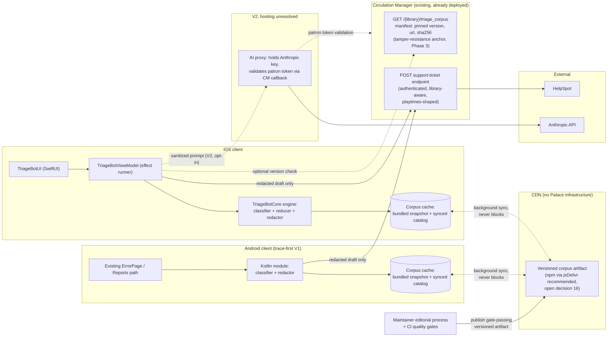
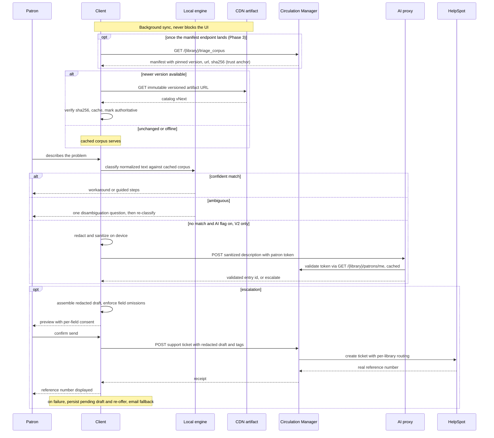

# Triage Bot: Shared Architecture (iOS + Android + Server)

<!-- audit-verified: PP-4882/4883/4884/4885/4886 summaries and story/sub-task structure verified via Jira API 2026-07-29; Android log-leak citations carried from section 8.4 footnotes, themselves audit-verified against android-core source -->

## Decision cover memo

**Decision requested.** Approve three things: (1) the direction of this document, the hybrid architecture of [section 14](#14-rationale-motivations-and-alternatives); (2) Phase 0 and Phase 1 of the [delivery plan](#13-delivery-plan); (3) authorization to start three organizational conversations now, because each has a lead time engineering does not control: HelpSpot access (API docs, sandbox, support contact, [section 5.5](#55-helpspot-integration-a-known-unknown)), the Palace AWS account operator ([section 17](#17-organizational-dependencies)), and the `android-core` maintainer ([section 8](#8-android-implementation)). **Explicitly not being approved yet:** Android dates, the AI proxy (Phase 4), and Phase 3 scope. Those return as separate decisions when their prerequisites exist.

**Accountable owner.** The frontmatter's `owners: [support, infrastructure]` are team labels, not accountability. The accountable owner for this proposal and the iOS work is the iOS lead, Maurice Carrier. The Android owner and the backend owner are **unassigned, needed**: no Android or CM work in this plan is real until a named person accepts it.

**Cost, honestly.** Phases 0 and 1 are near-zero infrastructure: a telemetry consumer and a CDN artifact (jsDelivr is free, S3 is cents, plus CI time). Phase 3 is not estimable until the HelpSpot prerequisites of [section 5.5](#55-helpspot-integration-a-known-unknown) exist; any Phase 3 number produced before then is unfounded. Phase 4 is uncosted: it carries genuine ops burden and gets costed when scoped, not asserted here.

**Success metric and kill criteria, proposed.** Neither this document nor the as-built companion has defined what winning looks like or when to stop, so here is a concrete proposal for the team to accept or change. Success: within 90 days of the iOS flag going on, at least 15% of triage-bot sessions that would otherwise have produced a support ticket end without one (deflection rate, measured by the Phase 0 consumer via PP-4885). Kill: the program stops, rather than proceeding to Android or Phase 3, if after those 90 days deflection is under 5% and the corpus maintainer judges further corpus investment unlikely to change that. Both numbers are proposals, not findings.

**The do-nothing baseline.** What patron support costs today (ticket volume, staff time per ticket, resolution rates) is unknown. No deflection number can be judged against an unmeasured baseline, so establishing that baseline is a prerequisite for the success metric above, and it is currently nobody's task. It needs an owner before the metric can mean anything.

**Accepted risks.** Approving this plan means accepting the following. Each needs a named accepter, not a team label; the column stays blank until someone signs.

| Risk | Accepted by (name) |
|---|---|
| The corpus tamper window between Phase 1 and the Phase 3 manifest anchor ([section 4.3](#43-client-fetch-cache-and-integrity)) | _unassigned_ |
| The HelpSpot vendor credential stored in plaintext JSONB in the CM database ([C7](#3-design-constraints), [section 5.3](#53-credential-storage-rate-limiting-and-permanence)) | _unassigned_ |
| Patron problem text, redacted and sanitized on device, reaching a commercial AI vendor in V2 ([section 6](#6-server-ai-proxy-v2)) | _unassigned_ |

## Escalation: the Android log leak

> **Addressed to Mark Raynsford, as the `android-core` maintainer.** This review surfaced a pre-existing issue that is independent of the triage bot and of every decision in this document; it is recorded here so it is not lost, not because it belongs to this project. The shipped Android app's existing "report an issue" flow zips up to seven days of logs into a mail intent; release builds log at DEBUG level; and `AccountUsername` and the SAML/OIDC `accessToken` fields are logged wholesale, with no redaction anywhere in that codebase. Only `AccountPassword` redacts. This is present in the shipped app today, bot or no bot, and does not depend on anything decided here. The assessment and the fix are the maintainer's to own. It also matters to this plan: the bot would use the same path, so it is a prerequisite for the Android work as well as an issue in its own right. Citations and the scoping ask are in [section 8.4](#84-prerequisite-workstream-report-redaction).

**Status: revision 4. The iOS client is built and flagged off; none of the server or Android components exist yet.** This document is written as the documentation for those components, ahead of their build: when the corpus artifact, the ticket endpoint, and the Android module exist, this is the document an engineer reads to understand them. The [open-decision register](#16-open-decisions) is the single authority on what is settled versus open; if a fork appears in prose but not in the register, that is a bug in this document.

**Audience:** Palace engineering and technical leadership; the backend engineer scoping the server work; the `android-core` maintainer evaluating the Android work.
**Companion:** [`triage-bot-v1-as-built.md`](./triage-bot-v1-as-built.md) documents the shipped iOS implementation and owns all facts about it (engine behavior, corpus field semantics, redaction pattern inventory, test posture). This document links there rather than restating; where the two ever disagree, the as-built document wins. Every claim here was verified against source in the named repos; citations are footnoted.

**Reader's map.** Read section 1, then jump:

| You are | Read | Skip |
|---|---|---|
| The backend engineer | [3](#3-design-constraints), [4](#4-server-corpus-distribution), [5](#5-server-support-ticket-endpoint) (the wire contract is in [5.1](#51-endpoint-specification), in the open), [6](#6-server-ai-proxy-v2), [7](#7-server-telemetry), [13](#13-delivery-plan) | 8, 9, 10 |
| The `android-core` maintainer | [3](#3-design-constraints) (C9), [8](#8-android-implementation), [9](#9-cross-platform-conformance-fixtures), open decisions 8, 9, 15, 19 | 5.1 internals, 6, 10 |
| An iOS maintainer | [4.3](#43-client-fetch-cache-and-integrity), [10](#10-ios-component-disposition), [9](#9-cross-platform-conformance-fixtures) | 5.2, 5.3, 8.4 |
| A decision-maker | The [cover memo](#decision-cover-memo) first, then [1](#1-overview), [13](#13-delivery-plan), [16](#16-open-decisions), [17](#17-organizational-dependencies) | everything else |

## 1. Overview

The triage bot is a fully on-device support assistant: an 18-entry knowledge catalog[^catalog], a deterministic substring-region classifier, on-device redaction, and escalation to a support ticket. iOS V1 ships it behind a default-off flag[^flags]; under production defaults (`triage_bot_ticket_submission_enabled` off) the wired ticket transport is clipboard-only, with the patron's own mail composer behind that submission flag ([as-built companion, section 7](./triage-bot-v1-as-built.md#7-the-escalation-path)). The shared architecture keeps everything latency-, privacy-, and offline-sensitive on the clients and gives the server exactly three jobs: **distribution, ticket creation, and key custody**.

| Piece | Design |
|---|---|
| Corpus distribution | Versioned, immutable CDN artifact, gate-checked before publish ([section 4](#4-server-corpus-distribution)). Recommended channel: an npm package served via jsDelivr ([open decision 16](#16-open-decisions)). No corpus service. |
| Ticket submission | `POST` endpoint on the existing Circulation Manager: authenticated, library-aware, playtimes-shaped ([section 5](#5-server-support-ticket-endpoint)). No standalone gateway service. |
| AI key custody (V2) | A server-side proxy holding the Anthropic key; hard prerequisite for the AI fallback, longest-lead item, last phase ([section 6](#6-server-ai-proxy-v2)). |
| Classification, redaction, offline | On the clients, always. Android V1 is a small trace-first integration into the existing report path ([section 8](#8-android-implementation)). |
| Engine sharing | Hand-ported Kotlin classifier kept aligned by shared conformance fixtures ([section 9](#9-cross-platform-conformance-fixtures)); not KMP, not Swift-on-Android today ([section 8.6](#86-engine-sharing-kotlin-swift-on-android-or-kmp)). |

**Explicitly not built:** a corpus service, a standalone HelpSpot gateway, a server-side classifier (rejected: it destroys offline behavior and moves patron text server-side on every turn, [section 14](#14-rationale-motivations-and-alternatives)), or a shared engine binary.

**Build order:** first, the iOS launch gate, turning the shipped bot on for patrons, because it produces the data everything downstream steers by; then the telemetry consumer (days) and corpus hot-update via CDN, both with zero new infrastructure; the CM endpoint next; the AI proxy last ([section 13](#13-delivery-plan)).

## Contents

- [Decision cover memo](#decision-cover-memo)
- [Escalation: the Android log leak](#escalation-the-android-log-leak)

1. [Overview](#1-overview)
2. [Architecture](#2-architecture)
3. [Design constraints](#3-design-constraints)
4. [Server: corpus distribution](#4-server-corpus-distribution)
5. [Server: support-ticket endpoint](#5-server-support-ticket-endpoint), including the [request/response contract](#51-endpoint-specification) and the [HelpSpot known unknown](#55-helpspot-integration-a-known-unknown)
6. [Server: AI proxy (V2)](#6-server-ai-proxy-v2)
7. [Server: telemetry](#7-server-telemetry)
8. [Android implementation](#8-android-implementation), including [engine sharing: Kotlin, Swift on Android, or KMP](#86-engine-sharing-kotlin-swift-on-android-or-kmp)
9. [Cross-platform conformance fixtures](#9-cross-platform-conformance-fixtures)
10. [iOS: component disposition](#10-ios-component-disposition)
11. [Privacy model](#11-privacy-model)
12. [End-to-end flow](#12-end-to-end-flow)
13. [Delivery plan](#13-delivery-plan)
14. [Rationale: motivations and alternatives](#14-rationale-motivations-and-alternatives)
15. [Signals that adjust this design](#15-signals-that-adjust-this-design)
16. [Open decisions](#16-open-decisions)
17. [Organizational dependencies](#17-organizational-dependencies)

## 2. Architecture



All redaction happens inside the client engines before anything crosses a line to the backend ([section 11](#11-privacy-model)). The only box requiring new deployed infrastructure is the V2 AI proxy, and even that has a CM-hosted alternative ([section 6.2](#62-hosting)).

## 3. Design constraints

These are inputs every implementer must respect. The first three are load-bearing enough to state as rules.

> **Constraint C1: redaction happens on-device, before transmission, always.** Non-negotiable. No design may move unredacted patron text off the device; this alone excludes a server-side classifier. Consequence: `ContextRedactor` (and its Kotlin port) runs before any byte reaches the CM, the proxy, or Anthropic.

> **Constraint C2: the patron bearer token can be validated by the CM and by nothing else, and for basic-auth libraries its plaintext contains the patron's plaintext password.**[^jwe] The token is the most sensitive datum in this system. Consequence: it may be sent to the CM, which minted it, and to nothing else, ever; any service that needs "is this patron valid" must ask the CM ([section 6.1](#61-authentication)). It is never logged.

> **Constraint C3: new services are organizational requests, not engineering tasks.** There is no infrastructure-as-code anywhere in the org: zero Terraform, CloudFormation, CDK, Kubernetes, Helm, or ECS task definitions; every CI pipeline ends at "push image to ghcr.io"; everything between GHCR and serving traffic is operated out-of-band by whoever runs the Palace AWS account (almost certainly ECS; the sole evidence is prose[^ecs-prose], UNVERIFIED beyond that). Consequence: designs prefer CDN artifacts and endpoints on the already-deployed CM; anything needing a new service is last in the plan and its organizational ask starts early ([section 13](#13-delivery-plan)).

| # | Constraint | Consequence |
|---|---|---|
| C4 | Per-library support routing already exists: admin-editable `help_email`/`help_web` settings, emitted into every Authentication Document as `rel="help"` links[^help-settings]; Android already routes its report flow from them | Ticket transport must be library-aware. A component hard-coding one HelpSpot instance would be the first in the system to break multi-tenancy; routing lives in per-library CM configuration ([section 5.2](#52-per-library-routing)) |
| C5 | The CM's HTTP API is unversioned (no `/v1/`, no deprecation policy, a 127-line `openapi.yaml` covering 2 admin paths) and bends to old clients indefinitely | Anything added to the CM is permanent. Wire contracts are pinned with `@type` discriminators plus fixtures before shipping, not after ([section 4.1](#41-artifact-and-versioning)) |
| C6 | CM webapp capacity: uWSGI runs 3 processes x 2 threads = 6 concurrent requests per container; `harakiri = 45` kills anything over 45 seconds[^uwsgi] | Short outbound POSTs (HelpSpot) fit; a synchronous LLM call pins one of six workers and can degrade borrow/fulfill, which shapes the proxy hosting choice ([section 6.2](#62-hosting)) |
| C7 | CM credential storage is an env var or `IntegrationConfiguration.settings_dict`, plaintext JSONB in Postgres edited through the admin UI[^integration-jsonb]; there is no secrets vault in this stack | The HelpSpot account owner is told this before the API credential is issued ([section 5.3](#53-credential-storage-rate-limiting-and-permanence)) |
| C8 | No rate-limiting infrastructure exists anywhere in the CM (no `flask-limiter`/`slowapi`, no Redis token bucket; the only 429 handling is outbound retry[^outbound-429]) | Abuse control is net-new for every new endpoint; the AI proxy's quota system is built from scratch ([section 6.3](#63-proxy-specification)) |
| C9 | `android-core` conventions: single active maintainer (66 of 66 commits in 90 days), documented OSGi-derived API/SPI/impl discipline, pure-JVM library modules, all tests in the monolithic `palace-tests` module, no Compose/`ViewModel`/`Flow`/reducer/Remote Config anywhere | The Android module is pure-JVM in the existing mold, consumes fixtures via `palace-tests`, and introduces no foreign patterns; design conversations with the maintainer precede code ([section 8](#8-android-implementation)) |
| C10 | Corpus quality is enforced only by the in-repo gate suites[^quality-gates]; a keyword edit can silently collapse recall (this failure class has occurred and the gates caught the repair) | No corpus version publishes without a green gate run; the gates travel with the catalog ([section 4.2](#42-publish-pipeline-and-quality-gates)) |

## 4. Server: corpus distribution

### 4.1 Artifact and versioning

The corpus ships as a **versioned, immutable artifact fetched from a CDN**: one artifact version per gate-passing corpus release. Clients ship pinned to the version current at build time and sync forward opportunistically. There is no corpus service.

The channel is [open decision 16](#16-open-decisions). **Recommended: an npm package served via jsDelivr.** Both candidate channels are already in production in this org: the CM serves its entire admin UI from a pinned npm package version on jsDelivr, with a version-resolution API and env overrides[^admin-cdn]; MARC exports are written to the public S3 bucket and indexed by the CM[^marc-s3]. What tips it: npm gives every published version an immutable URL **and** a version-resolution mechanism ([section 4.3](#43-client-fetch-cache-and-integrity)). Public S3 has no version resolution at all, so choosing S3 forces one of two additions: a mutable "latest" pointer object (rejected here, because a mutable pointer on the same channel undoes both the immutability story and the integrity story of [section 4.3](#43-client-fetch-cache-and-integrity)) or the CM manifest endpoint promoted to mandatory from Phase 1. If S3 is chosen, the manifest endpoint is non-optional; that is the position of this document.

**jsDelivr becomes a patron-scale dependency, and that deserves more than a precedent citation.** The CM admin UI precedent is an operator-facing tool with a small audience; this artifact, in this document's own words, authoritatively tells patrons what to do with their library accounts, at the install base's scale, over a free third-party CDN with no contract and no SLA. Availability first: if jsDelivr is down or unreachable, sync fails silently and every client keeps serving its cached corpus (or the bundled snapshot on a fresh install), so an outage degrades the bot to a stale corpus rather than breaking it; what is lost is update propagation, not function ([section 4.3](#43-client-fetch-cache-and-integrity)). Supply chain second: until the Phase 3 manifest anchor lands, the trust assumptions are exactly two, the npm publish account (2FA and provenance attestation required from day one; who holds those credentials is [open decision 21](#16-open-decisions)) and jsDelivr's own integrity, and that interim window is named in [section 4.3](#43-client-fetch-cache-and-integrity). The public-S3 alternative removes the third-party dependency by trading it for Palace-operated infrastructure, at the version-resolution cost stated above. The recommendation stands; the point of this paragraph is that a reader can see the trade being made rather than a footnote.

Versioning rules:

- Each catalog document and each entry shape carries a **`@type` discriminator string**. A new incompatible shape is a new `@type`, published alongside the old; clients decode the types they know and ignore the rest. This is the house idiom for cross-platform wire formats (`mobile-specs` bookmark selectors, e.g. `"@type": "LocatorHrefProgression"`), together with a JSON Schema and a valid/invalid fixture corpus.
- The artifact carries two versions: the human-legible content version already in use (`v1.2-2026-07-20`) and the package's own immutable version for cheap comparison.
- Shape retirement: old and new `@type`s are published side by side until installed-base data says otherwise. If the manifest endpoint exists, it evolves via the registry's endpoint-deprecation decorator, which emits RFC 9745 `Deprecation`, RFC 8594 `Sunset`, and RFC 5829 `successor-version` headers[^deprecation].

**Worked example.** The artifact is `catalog.json`, semantically identical to the bundled resource shipped today[^catalog] plus the `@type` discriminators this design adds. Envelope and one complete entry (abridged from the shipped `v1.2` catalog; a publisher can produce this shape without opening Swift source):

```json
{
  "@type": "TriageCatalog",
  "version": "v1.2-2026-07-20",
  "updated_at": "2026-07-20",
  "entries": [
    {
      "@type": "TriageCatalogEntry",
      "id": "HT-2026-009-formats-kindle",
      "category": "other",
      "kind": "how_to",
      "symptom_keywords": ["to kindle", "on kindle", "use kindle",
        "what formats", "which formats", "reading format",
        "send to my ereader"],
      "user_facing_workaround": "Palace isn't connected to Kindle. You read your borrowed books right in the Palace app: ebooks open in the built-in reader and audiobooks play in the built-in player.",
      "internal_reference": { "jira": "PP-4831" },
      "confidence_threshold": 0.1,
      "escalate_anyway": false,
      "helpspot_tag": "how-to-formats-kindle",
      "trust_level": "authoritative",
      "visibility": "user_facing",
      "ui_surface": "my-books",
      "reviewed_at": "2026-07-22"
    }
  ]
}
```

Discriminator values: `TriageCatalog` on the envelope, `TriageCatalogEntry` on each entry; new incompatible shapes are new `@type` strings per the versioning rules above. Known-issue entries additionally carry `status`, `distributor_filter`, `fixed_in_version`, `user_facing_steps`, and `escalation_follow_up`. Field semantics are owned by the [as-built companion, section 5](./triage-bot-v1-as-built.md#5-the-local-corpus); this document owns only the envelope, the discriminators, and the packaging. The JSON Schema and its valid/invalid fixtures live in the conformance home ([section 9](#9-cross-platform-conformance-fixtures)) and are the publish gate's input, so schema, fixtures, and artifact version together. A sha256 checksum file is published alongside the artifact; what that does and does not defend against is covered in [section 4.3](#43-client-fetch-cache-and-integrity).

### 4.2 Publish pipeline and quality gates

**No corpus version is publishable unless it has passed the full gate suite in CI** (constraint [C10](#3-design-constraints)). The pipeline:

1. The corpus lives in a repository (this one, or the conformance home of [section 9](#9-cross-platform-conformance-fixtures)); every edit is a pull request.
2. CI runs the lint, quality, hold-out, and governance suites against the candidate catalog.
3. Only a green, tagged version is published: an `npm publish` or S3 upload as the final CI step. The publish step is mechanical and auditable.

Curation is unchanged: a maintainer-run editorial process grounded in real HelpSpot tickets, with per-entry provenance in `internal_reference`. This design changes the distribution channel, not the editorial bar; no authoring tool or curator queue is assumed.

Because the quality corpora double as the conformance bar for the Kotlin engine, they are promoted from Swift test code to **language-neutral fixture files** (JSON case in, expected decision out) as part of this work ([section 9](#9-cross-platform-conformance-fixtures)).

Localization: the corpus is data, not string resources, so it does not flow through Transifex (which delivers Android's `en, es, fr, de, it` UI strings at cold start). Either the schema gains a locale dimension, multiplying the curation and gate surface per language, or the Android launch is gated to English. Product sign-off required; [open decision 9](#16-open-decisions).

<details>
<summary><b>Gate suites and thresholds</b></summary>

The publish gate runs the five suites that protect the catalog today[^quality-gates]: `CatalogSchemaLintTests` (schema validity), `ResponseQualityTests` (the quality-case corpus with its recall/precision/rejection ratchet), `HoldoutGeneralizationTests` (the blind hold-out built from real HelpSpot tickets), `HowToGovernanceTests` (`reviewed_at` against the UI-surface change log), and `RedactionCorpusTests` (the redaction fixture corpus). Threshold values are owned by the [as-built companion, section 9](./triage-bot-v1-as-built.md#9-test-posture); restating them here has already produced drift once and is not done.

</details>

### 4.3 Client fetch, cache, and integrity

**Fetch contract** (written for the recommended npm channel; package name indicative):

- **Artifact URL:** `https://cdn.jsdelivr.net/npm/@thepalaceproject/triage-corpus@1.3.0/catalog.json`. One immutable URL per published version; the npm package version is the artifact's "package version" from [section 4.1](#41-artifact-and-versioning).
- **Version discovery:** `GET https://data.jsdelivr.com/v1/packages/npm/@thepalaceproject/triage-corpus/resolved` returns the current published version, the same resolution mechanism the CM admin UI already relies on[^admin-cdn]. Once the manifest endpoint exists ([section 4.4](#44-manifest-endpoint)), the manifest's pinned version takes precedence over jsDelivr resolution.
- **Sync cadence:** opportunistic background sync on bot open, at most once per 24 hours, never blocking any interaction. Corpus changes are editorial and low-frequency; daily is ample. Failure is silent; the cached corpus serves.
- **Rollback:** published npm versions are immutable and cannot be reliably unpublished, so rollback is publishing the prior content as a new, higher version through the same gate pipeline. Once the manifest exists, operators can additionally pin clients back to any prior version instantly, without a publish.
- **Cold start:** the bundled snapshot (today's `catalog.json`, unchanged in role) decodes and serves immediately, flagged non-authoritative until the first successful CDN sync.

**Integrity versus tampering.** A client verifies the download's sha256 and, on mismatch, discards it and keeps its current corpus. But be precise about what each checksum source buys:

- The **checksum file published beside the artifact** defends against corruption only. It travels the same channel as the artifact, so an attacker who can replace the artifact can replace the checksum. For an artifact that authoritatively tells patrons what to do with their library accounts, that is not enough.
- The **manifest-served sha256** ([section 4.4](#44-manifest-endpoint)) comes from a different trust domain (the CM, over its own TLS origin) and is the chosen tamper-resistance mechanism. This is why the manifest is no longer optional at GA. Signing the artifact instead (detached signature, public key baked into clients) was considered and set aside: it introduces key custody and rotation with no org precedent, for the same trust separation the manifest provides with a controller the org already operates.
- **Interim window, named:** Phase 1 ships before the Phase 3 manifest, so between them the corpus is corruption-protected but not tamper-protected beyond npm's own account security (2FA and provenance attestation on the publish step are required from day one). A compromise of the npm package or CDN in that window could serve a tampered corpus. Accepting that window is part of approving the phase order in [section 13](#13-delivery-plan).

The cache follows the app's preloaded-registry pattern[^registry-pattern], so the bot is fully functional offline with, at worst, a corpus as stale as the installed build; offline classification is preserved, not rebuilt.

<details>
<summary><b>Cache pattern mapping and HTTP details</b></summary>

| Preloaded registry (as built) | Corpus cache (this design) |
|---|---|
| Build-time snapshot generated by `scripts/snapshot-library-registry.py`; hard-fails the build on bad input | Build-time corpus snapshot: the newest gate-passing catalog baked into each release |
| Disk cache loads instantly, stale-while-revalidate | Last synced catalog loads instantly from disk; classification never waits on network |
| Cold first launch decodes the bundled snapshot off-main, flagged non-authoritative until a real network response overwrites it | Cold first open uses the bundled corpus, flagged non-authoritative until the first successful sync |
| Network refresh always fires afterward; the bundled snapshot is a fast-path, not a replacement | Background sync always fires on bot open; failure is silent, cache serves |
| Missing resource returns nil and falls through rather than throwing | Any corpus-source failure falls down the ladder; never a crash, never a blank bot |

HTTP: immutable versioned URLs make conditional GET unnecessary; the client asks "is there a newer version than mine" (manifest endpoint, or the CDN's version-resolution path) and then fetches a URL that caches perfectly. Conditional GET is also not a house pattern to imitate: the library registry has zero ETag/304 support and the CM has essentially none on patron endpoints; house cache discipline is `Cache-Control` with `s-maxage` at half `max-age`[^cache-util]. One caution: the registry emits a malformed `max-age: 43200`, colon instead of equals[^registry-cache-bug]; do not copy the bug.

</details>

### 4.4 Manifest endpoint

`GET /{library}/triage_corpus`, returning `version`, `url`, `sha256`. Decorated with the house cache-control helper[^cache-util]. It makes the pinned version an operator-controlled server setting while the bytes still come from the CDN, exactly the MARC pattern with jsDelivr transport, and it is one controller on an already-deployed service.

**The corpus is one global artifact; there is no per-library corpus content.** The `{library}` path segment exists because every patron-facing CM route carries it, not because the response varies by library: the pinned version is a single server-wide setting, and clients cache the corpus under one global key. An earlier revision's "pinned version for that library" wording was wrong and is retracted. If per-library corpora are ever wanted, that is a new design (per-library cache keying, per-library gate runs, a multiplied curation surface), not a setting flip.

An earlier revision made this endpoint optional. Two things changed that: it is the tamper-resistance anchor for the corpus ([section 4.3](#43-client-fetch-cache-and-integrity)), and on the S3 branch of [open decision 16](#16-open-decisions) it is the only version-resolution mechanism. **It is required at GA; only its timing is open** ([open decision 10](#16-open-decisions)). It lands with the Phase 3 CM work; the interim window is named in section 4.3.

## 5. Server: support-ticket endpoint

A new authenticated endpoint on the Circulation Manager, `POST /{library}/support_tickets` (name indicative), modeled on the playtime-entries controller[^playtimes]: `@requires_auth` resolves the patron, `@has_library` resolves the library, the handler validates the body and makes one short outbound POST to the library's configured HelpSpot, well inside the CM's 45-second ceiling (constraint [C6](#3-design-constraints)).

What it delivers over the mail-composer transport shipped in iOS V1[^email-gateway]:

- **Real reference numbers**, returned synchronously from HelpSpot at submission (V1 synthesizes `EMAIL-<epoch>` strings locally).
- `helpspot_tag` and `matchedEntryId` **actually routing tickets** instead of decorating attachments.
- Eventually, a credible substrate for the notify-me-on-fix flow, which is a stub today[^reducer].

Server-side HelpSpot integration is a new build: none has ever existed anywhere in the org (all 118 HelpSpot references are in `ios-core`), and the CM's ancestral patron-complaint system was deliberately deleted[^complaints-deleted].

### 5.1 Endpoint specification

The request body is the client's redacted, patron-previewed draft: the serialized output of `sanitizedForSubmission()`[^ticket-draft]. Per-field omission is enforced at serialization on the client, so **omitted fields are absent from the wire entirely**; the server never sees them. The wire contract gets the same `@type` + JSON Schema + fixture discipline as the corpus before it ships (constraint [C5](#3-design-constraints)). Proposed contract, to be pinned by schema and fixtures before implementation; field names indicative.

Request, `Content-Type: application/json`, patron bearer token in `Authorization`:

| Field | Type | Semantics |
|---|---|---|
| `@type` | string | `TriageTicketDraft`; new incompatible shapes are new `@type`s |
| `idempotency_key` | string (UUID) | Client-generated per draft, stored with the pending draft, reused unchanged on every retry of that draft. See idempotency below |
| `summary` | string | Short patron-facing problem statement, redacted client-side |
| `description` | string | The redacted draft body the patron previewed and consented to |
| `matched_entry_id` | string, optional | Catalog entry the classifier matched, if any |
| `helpspot_tag` | string, optional | Routing tag from the matched entry |
| `context` | object, optional | The redacted context snapshot; every field individually omittable by the patron |
| `client` | object | `platform` (enum: `ios`, `android`), `app_version` (semver string), `os_version` (string). Used for triage, not identity; new platforms extend the enum |

There is **no attachments field** in this contract. Log attachments, if ever wanted, are a new `@type`, gated on the retention and redaction obligations of [section 11](#11-privacy-model).

Responses. Every non-2xx body is a **problem-detail document in the CM's house format** (RFC 7807 shaped: `type`, `title`, `status`, `detail`), the same format both apps already parse on the sign-in paths; no new error format is introduced. Error cases are discriminated by the problem-detail `type` URI, not by inventing status codes:

| Status | Body | Client behavior |
|---|---|---|
| 201 | `@type: TriageTicketReceipt`, `reference` (HelpSpot id), `status` (enum: `received` is the only value at launch; new states extend the enum) | Show the real reference number |
| 400 | Problem detail: schema-invalid body | Bug; do not retry unchanged |
| 401 | Problem detail: invalid/expired patron token | Re-authenticate, retry |
| 404 | Problem detail, two `type`s: unknown library, or library routing configured as `none` ([section 5.2](#52-per-library-routing)) | Do not retry; fall back to the email ladder ([section 5.4](#54-degraded-ladder)) |
| 413 | Problem detail: request body over **64 KB** (whole body; in practice only `context` can grow) | Trim `context`, largest sections first, re-offer; never trim `description` |
| 429 | Problem detail: rate limited. **Live from day one**, not reserved: the endpoint ships with a minimal fixed-window per-patron limit ([section 5.3](#53-credential-storage-rate-limiting-and-permanence)) | Back off, persist draft |
| 502 / 504 | Problem detail: HelpSpot unreachable or timed out | Persist pending draft, re-offer next open ([section 5.4](#54-degraded-ladder)) |

**Idempotency.** The degraded ladder deliberately persists a draft after a 502/504 and re-offers it, and ticket creation is synchronous; without dedup, a create that succeeded in HelpSpot but failed on the response path produces a duplicate ticket on every retry. So: the server records `(library, patron, idempotency_key)` against the HelpSpot reference for 7 days; a replay inside that window creates nothing and returns the original receipt with 201. The client never regenerates the key for a persisted draft. Duplicates are a bug, not an accepted outcome.

### 5.2 Per-library routing

Routing is per-library CM configuration, resolved by the endpoint at submission time (constraint [C4](#3-design-constraints)): which HelpSpot destination a library's tickets go to, or `none` (returned to the client as a 404 problem detail, [section 5.1](#51-endpoint-specification)). The per-library `help_email`/`help_web` settings already exist, are admin-editable, and are already delivered to both apps in every Authentication Document as `rel="help"` links[^help-settings]; the Android app already routes its report flow from exactly those links. The endpoint extends that model rather than introducing a parallel one.

**The routing configuration schema is undecidable from the repos and is [open decision 18](#16-open-decisions).** Two topologies fit the model above, and they store the credential differently:

- **One HelpSpot instance, per-library mailbox/category.** Per-library config is a routing value only; the single API credential is an env var. The smaller build.
- **Per-library HelpSpot instance and credential.** Per-library config is `{base_url, credential, mailbox}` in `IntegrationConfiguration.settings_dict`, which is plaintext JSONB (constraint [C7](#3-design-constraints)), multiplying the credential-custody conversation by the number of instances.

Which topology is real is a support-organization fact, not an engineering choice; it is one of the named HelpSpot prerequisites in [section 5.5](#55-helpspot-integration-a-known-unknown) and must be answered before the config schema or the credential story can be written.

### 5.3 Credential storage, rate limiting, and permanence

- **Credential:** the HelpSpot API credential lands in an env var or in plaintext JSONB (constraint [C7](#3-design-constraints)); the `hidden: bool` in admin form metadata is display-only, not encryption. The HelpSpot account owner is told this before issuing the credential.
- **Abuse control:** net-new (constraint [C8](#3-design-constraints)), though far less than the proxy needs, and **the endpoint ships with it, not before it**: a minimal fixed-window per-patron limit (indicative: 5 submissions per patron per hour, enforced in the handler against Postgres, no new infrastructure), with 429 live from day one ([section 5.1](#51-endpoint-specification)). Support sign-off, a named precondition in the client code[^email-gateway], sets the numbers and the routing rules; it does not decide whether limits exist. An earlier revision marked 429 "reserved for future quota", which contradicted both that precondition and constraint C8; ship-with-limits is the resolution.
- **Permanence:** this contract is forever once shipped (constraint [C5](#3-design-constraints)); hence the schema-and-fixtures discipline up front.
- **Privacy:** required before shipping: a data-retention policy for payloads and attached logs, and PII review ([section 11](#11-privacy-model)). On Android, the log-redaction prerequisite ([section 8.4](#84-prerequisite-workstream-report-redaction)) gates this endpoint's use.

### 5.4 Degraded ladder

1. CM endpoint, when reachable.
2. On failure: persist the pending draft (`triagebot.pendingDraft`) and re-offer on next open.
3. Email composer as the manual fallback; clipboard when mail is unavailable.

Whether email remains a patron-visible fallback long-term or becomes error-path-only is [open decision 1](#16-open-decisions). A full offline submit queue with background sync is not part of this design.

### 5.5 HelpSpot integration: a known unknown

**The HelpSpot side of this endpoint is unspecified, deliberately, because nobody in these repos can specify it.** All 118 HelpSpot references in the org are iOS-side strings; no server-side integration has ever existed ([section 5](#5-server-support-ticket-endpoint)). Nothing in any Palace repo records the HelpSpot API endpoint, its auth scheme, its version, or the mapping from this contract's fields (`summary`, `description`, `matched_entry_id`, `helpspot_tag`, `context`, `client`) onto HelpSpot's fields, categories, and mailboxes. Inventing that mapping here would be fiction, so it is documented as a prerequisite list instead:

1. **HelpSpot API documentation** for the version the org actually runs, including auth scheme and the create-ticket surface.
2. **A sandbox instance** to develop and test against; tickets created during development must not land in a live support queue.
3. **A support-staff contact** who owns the field/category/mailbox mapping, the routing topology answer ([section 5.2](#52-per-library-routing)), and the rate-limit numbers ([section 5.3](#53-credential-storage-rate-limiting-and-permanence)).

**Phase 3 cannot be estimated until all three exist.** The mapping and the outbound client are most of Phase 3's engineering; any Phase 3 estimate produced before these prerequisites land should be treated as unfounded ([section 13](#13-delivery-plan)).

## 6. Server: AI proxy (V2)

The proxy is the hard prerequisite for enabling `triage_bot_ai_fallback_enabled` in production on any platform. It holds the Anthropic key so no device ever does; `AnthropicKeyStore` is deleted when it lands. Device-side custody is a live, evidenced hazard: a key baked into a binary is extractable with `strings` in seconds[^keystore], and there is a recorded incident of the key pasted into a tracked Xcode scheme, caught only by manual diff review.

### 6.1 Authentication

The proxy authenticates callers by **forwarding the patron bearer token to the CM** (`GET /{library}/patrons/me`; a 200 means valid) and caching the validation result for a **fixed window of 5 minutes, keyed on a hash of the token**. Residual-TTL caching is impossible by construction: the token is an opaque encrypted JWE with no introspection endpoint (detail below), so the proxy cannot know when it expires. A fixed window bounds the staleness instead; 5 minutes is small against the 60-minute token TTL and means a revoked or expired token is honored for at most 5 minutes past the CM's own answer. This is the only viable design under constraint [C2](#3-design-constraints): nothing outside the CM can validate a token even in principle, and sharing the CM's database is excluded because it would hand the proxy the JWE key and, with it, every presenting patron's plaintext PIN. Costs of the callback design: a CM round trip per uncached request, availability coupling to the CM, and the fact that `/patrons/me` returns the patron's barcode, PII the proxy should not want to hold.

A cheap enabling change, useful independent of this project: `Patron.uuid`[^patron-uuid] is a resettable pseudonymous identifier not currently exposed on `/patrons/me`; exposing it is roughly a one-line change and gives the proxy a non-PII per-patron quota key. A purpose-built validate-and-return-uuid endpoint would be better still. [Open decision 12](#16-open-decisions).

<details>
<summary><b>Patron token formats, and why nothing else can validate them</b></summary>

- Basic-auth libraries: the bearer token is a **JWE**, encrypted rather than signed (`alg=dir`, `enc=A128CBC-HS256`), with the symmetric key stored in the CM's Postgres `keys` table (`KeyType.AUTH_TOKEN_JWE`) and **rotated daily**; TTL 3600s[^jwe].
- The JWE plaintext is `{"id": <patron_pk>, "pwd": <patron password, in the clear>}`, deliberately and load-bearingly: the CM extracts the credential to forward the patron's real password to vendors during borrow and fulfill[^token-consumption]. The password cannot be removed to make the token safe to share.
- There is no JWKS, no public key, and no introspection endpoint.
- SAML/OIDC libraries: a 3-segment HS256 JWT, shared secret in the same `keys` table, payload carrying the upstream IdP token; format discriminated by dot-count[^saml-jwt]. Same conclusion.

The comment in the iOS code describing the endgame ("the app authenticates to the proxy with the patron's existing session"[^keystore]) is satisfiable only via the CM-callback design above.

</details>

### 6.2 Hosting

Where the proxy runs is [open decision 11](#16-open-decisions); both options are documented because either could be chosen.

- **CM-hosted.** No new service, token validation is native, ships on the normal release train. But the CM webapp is a poor host for a synchronous LLM call under constraint [C6](#3-design-constraints): one Anthropic call pins one of six workers per container for its whole duration, and a burst of bot traffic could visibly degrade borrow and fulfill for the same library's patrons. The client's 8-second timeout fits inside `harakiri`; capacity is the problem, not the deadline. If chosen, it ships behind a per-library flag with strict concurrency caps, and worker-pinning telemetry is the go/no-go.
- **A new service.** The right shape technically, but an out-of-band organizational request under constraint [C3](#3-design-constraints), on a timeline nobody in these repos controls. The code half is repeatable if approved: `library-registry` (Flask + gunicorn) and `virtual-library-card` (Django) share a structurally identical service template.

Either path makes the proxy the longest-lead item in the plan, which is why it is Phase 4 and why the AI fallback stays inert everywhere until it lands.

<details>
<summary><b>CM capacity numbers and the new-service template</b></summary>

- CM runtime limits: uWSGI `3 processes x 2 threads` per container, `harakiri = 45`, `reload-on-rss = 425` MB, nginx `uwsgi_read_timeout 45`[^uwsgi].
- Structural precedent for a synchronous patron-facing endpoint calling a third-party API with a DB-stored credential: the NoveList recommendations endpoint[^novelist]. Its latency profile is nothing like an LLM call, which is why precedent does not settle the hosting question.
- New-service template shared by `library-registry` and `virtual-library-card`: Dockerfile + docker-compose + a `build.yml` that builds a multi-arch matrix, pushes by digest, tests against the exact built digest, and fuses with `docker buildx imagetools create`; migrations run in the container entrypoint; registry auth via the ambient `GITHUB_TOKEN`, so no secrets to provision.

</details>

### 6.3 Proxy specification

| Aspect | Specification |
|---|---|
| Holds | Anthropic key(s), prompt template, model selection, token budgets. None ever ship to a device |
| Client auth | Patron bearer token, validated via the CM ([section 6.1](#61-authentication)); never logged, never forwarded anywhere except the CM |
| Quota | Net-new (constraint [C8](#3-design-constraints)). Per-library first, per-patron second, keyed on `Patron.uuid` if exposed; global spend alerting; a kill switch independent of the client flag. An earlier revision asserted here that the library or consortium pays; that assertion is retracted, because nobody has agreed to it. Who pays is [open decision 20](#16-open-decisions). The client-side `FallbackRateLimiter` (10/min, 100/session)[^rate-limiter] remains politeness, not defense |
| Response contract | The proxy enforces the same strict-JSON contract and hallucination guard the client enforces today (0.6 confidence floor)[^ai-fallback]; the client re-validates, defense in depth |
| Input | Only the client-sanitized description, wrapped in `<description>` tags against prompt injection, with only `user_facing` corpus entries embedded[^ai-fallback]. Prompt bodies are not logged by default |

**Client-to-proxy wire contract, sketch.** The full contract is owed with the same `@type` + schema + fixture discipline as the other two wire formats, when Phase 4 is scoped; the sketch exists so the shape is not a blank. One endpoint, `POST /triage/classify`, patron bearer token in `Authorization`:

```json
{ "@type": "TriageAIRequest",
  "library": "short-name",
  "corpus_version": "v1.2-2026-07-20",
  "description": "the client-sanitized description only" }
```

```json
{ "@type": "TriageAIResponse",
  "entry_id": "KI-2026-001-audiobook-first-open-hang",
  "confidence": 0.8 }
```

`entry_id` is null when the model abstains or the proxy's validation rejects the answer; `corpus_version` lets the proxy embed the matching `user_facing` entries and refuse versions it no longer serves. Errors are the same house problem-detail format as [section 5.1](#51-endpoint-specification).

Current client baseline, for grounding: the client POSTs `api.anthropic.com/v1/messages` directly (model `claude-sonnet-4-6`, 8-second timeout) with a Keychain key supplied by a DEBUG env-var bootstrap or manual TestFlight paste. Release builds have no key path at all, so the fallback is inert in App Store builds by construction[^inert-tests], and stays so until Phase 4.

## 7. Server: telemetry

Nothing reads the bot's telemetry today, so a consumer comes before any data-driven prioritization. The destination is a genuine fork, recorded as [open decision 4](#16-open-decisions):

- **Option 1: Firebase.** The bot already emits through a 12-key allowlist[^telemetry-contract]; zero new work, readable in the console immediately. Limitation: no Palace warehouse ever sees Firebase events. QuickSight is fed by a separate reporting warehouse whose tables do not exist in the CM schema, whose ETL from the S3 analytics bucket exists in no public repo, and whose owner is UNVERIFIED.
- **Option 2: a CM ingestion endpoint** modeled on playtimes[^playtimes] (auth-required, structured-body, always-207, Celery-summed), which plausibly reaches the existing S3-to-warehouse path. Costs: CM code either way (analytics providers are hardcoded, not pluggable), patron auth on telemetry (a privacy design question in itself), the permanence commitment of constraint [C5](#3-design-constraints), and the UNVERIFIED ETL owner. The CM's existing mobile analytics endpoint is the wrong template: one event type, optional auth, forgeable, intermediary-cacheable.

**Recommendation: Option 1 for Phase 0**; Option 2 only if bot metrics must join library-facing reporting, and only after a human who operates that pipeline is identified.

## 8. Android implementation

### 8.1 Platform baseline

What the module builds on versus what would be net-new scope:

| Exists, build on it | Absent, in scope only if a design requires it |
|---|---|
| A support flow with the same email dead end as iOS: `palace-reports` zips `cacheDir/logs` plus time-tracking data and fires an `ACTION_SEND` mail intent[^android-reports]; per-library "Report an issue" resolves the library's `supportEmail` from its authentication document[^android-support-email] | Firebase Remote Config (Firebase is Crashlytics + FCM only; zero `RemoteConfig` hits repo-wide); a shared kill switch means a new dependency |
| A machine-readable failure trace: a structured `TaskStep` trace rides every error report (`ErrorPageParameters.taskSteps`), a richer failure signal than anything iOS has; note that the shipped classifier cannot consume it without a designed mapping ([section 8.5](#85-v1-shape)) | Reducer, effect interpreter, declarative UI: `fun reduce` appears zero times in 854 Kotlin files; zero Compose, `ViewModel`, or `Flow`; a chat UI would be a ground-up build with no house pattern |
| A porting template: 15 pure-JVM modules; `palace-announcements` (pure JVM + Jackson) is line-for-line what this module looks like; JUnit 5 + JSON fixtures is the dominant test idiom | A working telemetry sink: 11 events defined, the sole sink forwards only `BookOpened`[^android-analytics]; `firebase-analytics` is declared with zero call sites |

The bot **replaces an existing flow** rather than adding a new surface, and inherits that flow's email transport gap until the CM endpoint exists.

### 8.2 The module

A new **pure-JVM library module** in the `palace-announcements` mold (constraint [C9](#3-design-constraints)), wired into the existing `ErrorPage`/`Reports` path. It contains:

- **Classifier:** Kotlin port of `LocalClassifier` + `TextNormalizer`, reproducing the region-merge scoring and normalization exactly[^classifier], pinned by the conformance fixtures ([section 9](#9-cross-platform-conformance-fixtures)).
- **Redactor:** Kotlin implementation of `ContextRedactor`'s behavior, compiling the shared redaction pattern data ([section 9](#9-cross-platform-conformance-fixtures)) rather than hand-copying patterns; pinned by the redaction fixtures. The pattern inventory itself is owned by the [as-built companion, section 8](./triage-bot-v1-as-built.md#8-privacy-and-redaction).
- **Corpus store:** bundled snapshot loader (Android-native equivalent of `BundledCatalogSource`) plus the synced-catalog disk cache, same ladder semantics as iOS ([section 4.3](#43-client-fetch-cache-and-integrity)).
- **Corpus sync:** CDN fetch + sha256 verification, background, never blocking.
- **Version gate:** port of `FixVersionGate`/`SemanticVersion` (gating compares the patron's installed version; per-device by nature).

It deliberately does **not** contain: the conversational reducer, a chat UI, a Remote Config dependency, or a telemetry sink. Tests: module test tasks are disabled by the convention plugin, so conformance fixtures are consumed from `palace-tests`, which is already how Android consumes `mobile-specs` fixtures.

<details>
<summary><b>Porting hazards and reuse notes</b></summary>

- The classifier's `String.Index` range merging is a Foundation idiom; the Kotlin implementation is a rewrite against the fixtures, not a transliteration.
- Redaction patterns are authored in ICU `NSRegularExpression` dialect[^redactor] and must run under `java.util.regex` on Android. Two independently hand-maintained pattern sets that must agree byte-for-byte forever, across two regex dialects, is a standing drift machine in the one place drift means leaked credentials. So the pattern set is **versioned data, not code**, in the conformance home ([section 9](#9-cross-platform-conformance-fixtures)): each pattern with its flags, its replacement, and its application order, compiled by each platform at load, with a dialect-conformance suite pinning the known ICU-versus-`java.util.regex` divergences. The corpus already applies exactly this principle; the redaction fixture corpus remains the behavioral contract on top.
- If the `ConversationReducer` is ever ported (Android V2, data-permitting), a clock seam is injected first: `Date()` is currently called inside `reduce`[^reducer].
- The `ContextSnapshot` schema is shared; the Android provider's primary input is the `TaskStep` trace rather than OSLogStore output.
- `PendingDraftStore` and `DiagnosticsPreference` are shared as protocols/interfaces only; the concrete stores are platform-native.
- The `TelemetryContract` 12-key allowlist[^telemetry-contract] is duplicated as a cross-platform contract with a language-neutral pinning fixture; enforcement lives in each client's sink.

</details>

### 8.3 Behavioral contract

The module is correct when it matches the shared fixtures, not when it looks like the Swift code:

- Classifier decisions match the expected-outcome manifest for all quality and hold-out cases.
- Redactor output matches the redaction fixtures byte-for-byte on redacted spans.
- Corpus decoding accepts every valid fixture and rejects every invalid fixture, ignoring unknown `@type`s.

These fixtures are the same ones the corpus publish gate runs ([section 4.2](#42-publish-pipeline-and-quality-gates)), so a published corpus is guaranteed to behave identically under both engines, up to fixture coverage.

### 8.4 Prerequisite workstream: report redaction

Stated factually, because it is Android-owned: the existing Android report leaks materially more than iOS's, and there is zero redaction anywhere in the codebase. Release builds log at DEBUG to a rolling file with 7 daily archives, all zipped into the support email[^android-logs]; `AccountUsername` and SAML/OIDC `accessToken` have no `toString()` override and are logged wholesale[^android-logs]; only `AccountPassword` redacts. This finding is [escalated at the top of this document](#escalation-the-android-log-leak), addressed to the `android-core` maintainer: it predates the bot, exists in the shipped app today, and is the maintainer's to assess and fix regardless of what happens to this proposal.

Porting the redactor is necessary but **not sufficient**: a redacted transcript beside a log zip full of bearer tokens is theatre. Redaction at the logging boundary or at zip-assembly time is a prerequisite for any Android ticket submission, bot or no bot.

**This workstream is not a footnote to the bot, and this document will not size it.** It touches the logging posture of an entire codebase that today logs access tokens wholesale, and it is plausibly larger than the whole bot module it gates. It needs its own scoping exercise, owned by the `android-core` maintainer: an inventory of what the log zip actually leaks, a decision between the logging boundary and zip-assembly time, and an estimate produced from that inventory. Until that scoping exists, no Android delivery date that includes ticket submission is credible, and the Phase 2 line for it in [section 13](#13-delivery-plan) is a placeholder for the scoping, not for the work.

### 8.5 V1 shape

| | Full port | Trace-first V1 (recommended) |
|---|---|---|
| What ships | Classifier + reducer + redactor + new chat UI + remote-config kill switch | The module of [section 8.2](#82-the-module), wired into the existing `ErrorPage`/`Reports` path |
| Primary input | Patron-typed free text | The structured `TaskStep` trace, plus report text (classifier input mapping undesigned; see below) |
| New patterns introduced | Reducer, effect interpreter, declarative chat UI, Remote Config | None (constraint [C9](#3-design-constraints)) |
| Corpus benefit | Full | Full: same corpus, same sync, same workaround surfacing before a ticket is sent |
| Patron-visible change | New conversational surface | Existing report flow gains "this looks like a known issue, here is the workaround" plus redaction |
| Localization exposure | Full corpus locale problem at launch | Same corpus question, inside the already-localized report screen |
| Fit with maintainer's architecture | Poor, by its own documented discipline | Good |

**Trace-first is the preferred integration shape, with one honest hole: nobody has designed how a trace reaches the classifier.** The classifier's keywords are tuned to patron free text ("won't play", "just spins"); a `TaskStep` line reading "DRM license acquisition failed" shares no vocabulary with them, and every conformance case that exists, all 70 quality cases and all 6 hold-out cases, is a patron-text case. The recommended input path currently has **zero conformance coverage**. Two ways to close the hole, to be chosen with the maintainer:

- **(a) Design the trace-to-classifier mapping**: a curated table from `TaskStep` failure identifiers to the classifier's symptom vocabulary, itself versioned data in the conformance home, with **trace-input fixture cases committed as part of the Phase 2 fixture deliverable** ([section 9](#9-cross-platform-conformance-fixtures)). Only this option makes the trace a real classifier input.
- **(b) Classify only the patron's typed report text**, exactly as iOS does, and attach the trace to the ticket unclassified, where it already helps support today.

Until one of these is chosen, and for (a) until its fixtures exist, trace-first is **an option that requires design work, not a firm recommendation**. What is firm: the integration point (the existing report path, no foreign architecture) delivers redaction of what is sent either way, and the reducer and chat UI remain available as Android V2 if iOS data shows the conversation itself, rather than the knowledge surface, deflects tickets ([section 15](#15-signals-that-adjust-this-design)). [Open decision 8](#16-open-decisions), closed jointly with the maintainer before any code.

### 8.6 Engine sharing: Kotlin, Swift on Android, or KMP

The two-copies plan invites a fair challenge: why not run `TriageBotCore` itself on Android and keep one engine? The facts changed in March 2026: Swift 6.3 ships the first official Swift SDK for Android, owned by the Swift project's Android Workgroup, with generated interop tooling rather than hand-written JNI, over 2,200 packages building, and the recommended brownfield pattern being exactly this split, shared model layer with native UI per platform[^swift-android-sdk][^swift-android-wg][^swift-java]. The SDK is also, by its own characterization, work in progress (debugging, IDE integration, build times, binary size), and **the headline number is the bundled Swift runtime: around 60 MB on Android today**[^skip-blog], though the runtime is not the strongest argument below. KMP was an earlier assumption never acted on; no Kotlin exists for this feature, so the question is genuinely open rather than settled by default.

**Separate the two things being duplicated, because their risk profiles are opposite.** The classifier is roughly 200 lines of deterministic matching, pinned by 70 quality cases plus the hold-out set; its failure mode is a wrong answer, visible in the conversation and recoverable by escalation. The redactor is 15 regexes that must agree across two regex dialects (ICU on iOS, `java.util.regex` on Android), covered today by a handful of synthetic fixtures; its failure mode is a patron credential leaking silently into a support ticket, and that failure class has already occurred once on a single platform, the prose-password incident ([as-built companion, section 8](./triage-bot-v1-as-built.md#8-privacy-and-redaction)). "Should the engine be shared" is really two questions with different stakes, and the redactor is the one that earns real defenses.

**The governing principle: share the data, not the code.** Everything that must not drift is becoming data already: the corpus, the redaction pattern set as versioned pattern data compiled by each platform ([section 8.2](#82-the-module), the adopted resolution of the dialect-drift objection), and the conformance fixtures that act as the oracle for both engines ([section 9](#9-cross-platform-conformance-fixtures)). What gets reimplemented per platform is only the matching logic that consumes that data, which is precisely the part where fixtures can detect drift. That is a principled line, not a compromise: the artifacts whose failure is silent are single-sourced; the code whose failure is visible is duplicated under an oracle.

| | Kotlin hand-port (recommended) | Swift SDK for Android | KMP |
|---|---|---|---|
| What ships on Android | A few hundred lines of Kotlin in a pure-JVM module ([section 8.2](#82-the-module)) | `TriageBotCore` as a native `.so`, generated JNI bindings, ~60 MB Swift runtime | A new Kotlin Multiplatform module compiled for both platforms |
| Engine copies | 2, kept aligned by conformance fixtures ([section 9](#9-cross-platform-conformance-fixtures)) | 1 | 1, but only after rewriting the existing Swift Core in Kotlin |
| APK cost | Negligible | ~60 MB today | Small |
| Cost to `android-core` | None; matches constraint [C9](#3-design-constraints) | A second toolchain, native artifacts, and a JNI bridge in a single-maintainer repo with deliberately unified conventions | A new build plugin and a foreign module type |
| Cost to iOS | None | None; Core unchanged | Core rewritten or duplicated anyway |
| Maturity | Boring, known | Official but explicitly work-in-progress (debugging, IDE, build times, size) | Mature |
| Drift protection | Shared fixtures, with a working in-org precedent (`mobile-specs` on Android) | Perfect, by construction | Perfect within the shared module |
| Verdict | **Yes, for the engine that exists** | Not today; real revisit trigger below | No; rewrite costs without the benefit of sharing the existing Core |

**Why binary sharing loses, precisely.** The strongest reason is not the roughly 60 MB runtime or the second toolchain, though both are real and the runtime sits especially badly in an app whose stated motivations include low-end Android devices ([section 14](#14-rationale-motivations-and-alternatives)). It is that sharing a binary does not remove the interop cost; it relocates it, into a JNI bridge, a cross-repo build integration, a versioning story between two app repositories, and a two-app release dance in which an engine fix ships only when both apps cut releases. In an organization with no infrastructure-as-code and no self-service deployment (constraint [C3](#3-design-constraints)), relocating cost into shared build infrastructure is a worse trade than absorbing a few hundred lines of duplicated matching logic. The KMP column's cost holds for the same reason with one addition: KMP requires rewriting the existing Swift Core anyway, so it pays the sharing cost without sharing the code that exists.

**The ongoing tax of two copies, priced rather than omitted.** Every future change to scoring, guards, or redaction patterns becomes two pull requests in two repositories with a fixture-release bump between them, and two engineers who must both hold the semantics. In an organization with one Android maintainer and one iOS developer, that is a real recurring cost, not a rounding error, and the comparison table above does not capture it. It stays small only while the engine does; it is the first line item that grows if the engine grows.

**And the revisit is expensive, which is the strongest argument against this recommendation.** The triggers below should not be read as if reopening the decision were cheap. Migrating from two divergence-managed implementations to one shared engine later means retiring an implementation, re-verifying the survivor against both platforms' fixtures, and unwinding whatever platform-specific behavior has accreted; that costs more than starting shared would have. The recommendation is made with that admitted: at today's engine size the two-copy tax is small and the sharing cost is concentrated and immediate, but if the engine grows, having waited will have made sharing dearer.

**Decision: hand-port to Kotlin now; Swift-on-Android is a standing revisit trigger, not a closed door.** The decision flips if either (a) the Android runtime cost falls to a size the app can absorb, or (b) the engine grows into semantic or embedding matching or a much larger corpus, at which point the port stops being a few hundred lines and the sharing math changes. Condition (b) is the same trigger that reopens engine placement ([section 14](#14-rationale-motivations-and-alternatives)); revisit them together. [Open decision 15](#16-open-decisions).

### 8.7 Decisions owned by the Android maintainer

- Module naming, placement, and build wiring ([section 8.2](#82-the-module)); this document proposes the shape, the maintainer owns the fit.
- The V1 shape itself ([open decision 8](#16-open-decisions)); nothing here is built until that conversation happens.
- The log-redaction approach (logging boundary vs zip-assembly time, [section 8.4](#84-prerequisite-workstream-report-redaction)).
- The kill-switch mechanism, and **this one is decided before any code ships, not after** ([open decision 19](#16-open-decisions)). iOS's entire safety story is a Remote Config master flag[^flags]; Android has no Remote Config at all, so by default Android would ship a patron-facing support surface with **no remote off switch**. The candidates each carry a dependency worth stating: a corpus-manifest-driven disable couples "can we turn the bot off on Android" to the Phase 3 CM manifest ([section 4.4](#44-manifest-endpoint)) landing first; a build-time flag means the off switch is an app release; adopting Remote Config is a new dependency in a repo that has deliberately avoided it (constraint [C9](#3-design-constraints)).
- Locale gating at launch ([open decision 9](#16-open-decisions), jointly with product).

## 9. Cross-platform conformance fixtures

Two engine implementations stay aligned through a shared fixture corpus wired into both CIs. The org has both a working example and a cautionary one:

- **Working: `mobile-specs` on Android.** The bookmarks spec ships a JSON Schema, 23 named valid/invalid fixtures, and a `test-cases.txt` manifest of expected outcomes; Android consumes it as a git submodule tracking `main`, loaded by name in three real JUnit classes.
- **Cautionary: iOS.** `ios-core/.gitmodules` points at `mobile-bookmark-spec`, the archived predecessor repo (last pushed January 2022), pinned at that repo's first commit, cited only in a doc comment, with no XCTest loading the fixtures, while iOS production code implements the newer locator shape that only exists in current `mobile-specs`. iOS silently drifted ahead of its own vendored spec and nothing failed, because nothing was wired to fail.

**A fixture corpus only prevents drift if it is wired to tests.** The mechanism:

1. **A dedicated spec/fixture home** for the corpus schema and its valid/invalid fixtures, the classifier conformance cases, the redaction fixtures, and the redaction **pattern data** (each pattern with flags, replacement, and application order, compiled by each platform, [section 8.2](#82-the-module)), plus trace-input cases if option (a) of [section 8.5](#85-v1-shape) is chosen. Not retrofitted into `mobile-specs` (scoped to wire-format interop, unmoved since 2024), but borrowing its mechanics wholesale. Where this home lives, a new repo or a directory of an existing one, is [open decision 17](#16-open-decisions).
2. **Consumption at a pinned SHA with automated bump PRs, on both platforms.** Not a submodule tracking a branch: branch-following makes builds non-reproducible and lets an edit in the fixture repo redden a consumer's CI with no change in that consumer, which is exactly the objection the `android-core` maintainer is entitled to raise. The working `mobile-specs` example tracks `main` and got away with it; the iOS cautionary tale above is what unmanaged pinning does. The discipline is **managed pinning**: each platform pins a fixture-release SHA, an automated bump PR opens on each fixture release and runs that platform's conformance suite, and drift surfaces as a red reviewable PR in the consumer's own queue, never as ambient CI failure. iOS gains an XCTest fixture loader as part of this work.
3. The corpus publish gate ([section 4.2](#42-publish-pipeline-and-quality-gates)) runs the same fixtures, closing the loop.

**These fixtures do not exist in consumable form today.** The 70 quality cases, the 6 hold-out cases, and the redaction corpus live as Swift test code inside XCTest suites[^quality-gates]; nothing a Kotlin build can consume exists anywhere. **Extracting them is a named Phase 2 deliverable**, and that deliverable includes its own specification: the fixture file format (one JSON document per case: the input, the expected decision, and the expected matched entry id), what a case asserts (the decision and entry id only; candidate order and confidence values are deliberately not pinned, so scoring internals can evolve without republishing fixtures), and the repository ([open decision 17](#16-open-decisions)). The redaction fixtures must additionally pin at least one identifier-hash vector, an exact input with its exact `anon-xxxxxxxx` token: today no test on any platform pins a digest (only the `anon-` prefix is asserted), so a divergent Kotlin FNV-1a would pass every shipped suite even though the as-built declares cross-platform digest equality a conformance requirement. Both this document and the as-built companion lean on these fixtures as the real cross-platform contract, so be plain about the consequence: **until this deliverable lands, any Android engineering estimate is fiction**, and this is a hard precondition of the Kotlin classifier port.

## 10. iOS: component disposition

The iOS engine, redaction, and UI are unchanged by this architecture. The client-side deltas: `KnowledgeBaseSource`[^kb-seam] gains a `ServerCatalogSource` implementation (the seam was designed for exactly this, "future server-backed source (CDN-hosted catalog, hot-updatable)" in the protocol's own words); the ticket gateways gain the CM endpoint as primary transport; and at Phase 4 the direct Anthropic client is replaced by a thin proxy client and `AnthropicKeyStore` is deleted.

<details>
<summary><b>Full component disposition table</b></summary>

Everything in `Sources/TriageBotCore/` compiles and its 285 tests run on macOS via `swift test`[^package], practical proof the core could run server-side in Swift if that were ever wanted.

| Component | Disposition | Notes |
|---|---|---|
| `LocalClassifier`, `TextNormalizer` | Duplicated: Swift stays, Kotlin port | Fixture-pinned ([section 9](#9-cross-platform-conformance-fixtures)) |
| `ConversationReducer` | iOS-only; port deferred pending the Android V1 shape | Clock seam first if ported[^reducer] |
| `ContextRedactor` | Duplicated: Swift + Kotlin; never server-side | Constraint [C1](#3-design-constraints); ICU-to-`java.util.regex` re-verification[^redactor] |
| `catalog.json` + `KnowledgeBase` schema types | Becomes the CDN artifact; clients keep decoding | `@type`-versioned ([section 4.1](#41-artifact-and-versioning)) |
| `BundledCatalogSource` | Stays, demoted to cold-start fallback | `Bundle.module` is Apple-only; Android writes its own loader |
| `KnowledgeBaseSource` protocol | Stays; gains `ServerCatalogSource` per client | The rest of the system does not change |
| `FixVersionGate`, `SemanticVersion` | Duplicated: Swift + Kotlin | Per-device by nature |
| `AIFallbackPromptBuilder`, `FallbackClassifier` protocol | Sanitization stays client-side; prompt assembly moves to the proxy | Proxy owns the template; client owns sanitization |
| `ClaudeFallbackClassifier` | Replaced by a thin proxy client (V2) | Contract enforced at proxy AND re-validated on client[^ai-fallback] |
| `AnthropicKeyStore` | Deleted at Phase 4 | Its own doc comment says so[^keystore] |
| `FallbackRateLimiter`[^rate-limiter] | Stays as politeness; authoritative quota is server-side (V2) | [Section 6.3](#63-proxy-specification) |
| `EmailTicketGateway` / `ClipboardTicketGateway` | Stay as degraded fallbacks | Ladder in [section 5.4](#54-degraded-ladder) |
| `TicketDraft` + `sanitizedForSubmission()`[^ticket-draft] | Stays client-side; serialized form is the wire contract | [Section 5.1](#51-endpoint-specification) |
| `PendingDraftStore`, `DiagnosticsPreference` | Protocols shared; `UserDefaults` concretes iOS-only | Concretes live in Core despite Apple coupling[^persistence]; flag for cleanup |
| `TelemetryContract`[^telemetry-contract] | Duplicated contract; enforcement per client sink | Destination fork in [section 7](#7-server-telemetry) |
| `ContextSnapshot`, `ContextProvider` seam | Schema shared; providers per-platform | Android input is the `TaskStep` trace |
| `TriageBotUI`, `TriageBotViewModel` | Per-platform, never shared | Android chat UI deferred |
| Quality gates (5 suites)[^quality-gates] | Corpora promoted to language-neutral fixtures | [Sections 4.2](#42-publish-pipeline-and-quality-gates) and [9](#9-cross-platform-conformance-fixtures) |

</details>

## 11. Privacy model

Constraint [C1](#3-design-constraints) governs: redaction on-device, before transmission, always. Data flows under this architecture:

- **Corpus path:** read-only distribution; receives nothing from patrons.
- **CM support endpoint:** receives only the redacted, patron-previewed, field-omission-enforced draft; omitted fields never leave the device ([section 5.1](#51-endpoint-specification)).
- **AI proxy:** receives only the sanitized prompt; prompt bodies not logged.
- **Patron bearer token:** goes to the CM and nowhere else (constraint [C2](#3-design-constraints)).

On the client, `ContextRedactor` runs on every snapshot before the reducer sees it, on every patron-typed line at assembly, edit, and follow-up, on log lines, and via prompt sanitization; library identifiers are hashed to non-reversible cluster ids on device.

Obligations to resolve before the support endpoint ships:

- Retention windows for ticket payloads and any attached logs.
- The plaintext-JSONB credential reality (constraint [C7](#3-design-constraints)) communicated to the HelpSpot account owner.
- Android's log-zip leak fixed first ([section 8.4](#84-prerequisite-workstream-report-redaction)).
- The diagnostics opt-out UI shipped (`setIncludeDiagnostics` has zero callers in `Palace/`); its legal/GDPR review status is UNVERIFIED anywhere in the repo ([open decision 5](#16-open-decisions)).

## 12. End-to-end flow



## 13. Delivery plan

Constraint [C3](#3-design-constraints) orders the phases: zero-new-infrastructure work first, anything requiring a new deployed service last. Each phase is independently shippable and reversible.

<!-- audit-verified: PP-4882 story + sub-task summaries (PP-4883/4884/4885/4886) verified via Jira API 2026-07-29 -->

**The first milestone is not on the server at all: turning the shipped iOS bot on for patrons.** Every downstream decision in this plan steers by Phase 0 data, and Phase 0 data does not exist until the flag flips; that flip is the actual next step and it belongs in the plan, not in the gaps list. It is tracked as story PP-4882, "Triage bot: close the gaps that block turning it on for patrons," with four sub-tasks. Three gate the flag going on: PP-4883 (honor the patron's omission choices on every send path, closing the clipboard-path gap), PP-4884 (give patrons a diagnostics opt-out and clear the privacy review), and PP-4885 (be able to tell whether the bot is helping). PP-4886 (notify-me delivery) rides the story but does not gate the flag.

**Gate: no Phase 2 or later commitment is made until Phase 0 data exists.** [Section 15](#15-signals-that-adjust-this-design) already discloses that the plan's premise is unmeasured; disclosure is not a gate, so this line is the gate.

| Phase | What ships | New infrastructure |
|---|---|---|
| **Launch gate: iOS flag-on** (story PP-4882) | The three gating sub-tasks above (PP-4883, PP-4884, PP-4885), then `triage_bot_enabled` on for patrons. Precedes Phase 0 in effect: the measurement consumer has nothing to measure until this lands | None |
| **0: measurement** (client-only, days) | A Firebase-side consumer for the bot's existing telemetry, and the three or four steering numbers defined ([section 15](#15-signals-that-adjust-this-design)) | None |
| **1: corpus hot-update** | Publish pipeline ([section 4.2](#42-publish-pipeline-and-quality-gates)), `@type` schema ([section 4.1](#41-artifact-and-versioning)), `ServerCatalogSource` behind the `KnowledgeBaseSource` seam with the registry cache pattern ([section 4.3](#43-client-fetch-cache-and-integrity)), behind its own flag. Rollback is the flag; the bundled corpus is always underneath | None |
| **2: conformance home + Android conversation** | The fixture deliverable of [section 9](#9-cross-platform-conformance-fixtures) (fixture files, redaction pattern data, format spec); reducer clock seamed on iOS. Before any Kotlin: the maintainer conversation, the V1 shape and trace-mapping decision ([section 8.5](#85-v1-shape)), the kill-switch decision ([open decision 19](#16-open-decisions)), log-redaction **scoping** ([section 8.4](#84-prerequisite-workstream-report-redaction)), and the localization product decision | None. New dependency: people's calendars |
| **3: CM support-ticket endpoint + manifest endpoint** | [Section 5](#5-server-support-ticket-endpoint) and the manifest endpoint ([section 4.4](#44-manifest-endpoint), the corpus trust anchor). Requires support sign-off on rate limits and routing, retention and PII review, and the credential conversation. **Not estimable until the HelpSpot prerequisites of [section 5.5](#55-helpspot-integration-a-known-unknown) exist** (API docs, sandbox, support contact). Ships on the CM's 2-to-4-week release train | None, but new permanent CM API surface |
| **4 (V2 boundary): AI proxy** | [Section 6](#6-server-ai-proxy-v2). Prerequisite for enabling the AI fallback in production anywhere. Blocked on the hosting fork, the net-new quota design, and ideally the `Patron.uuid` exposure | Possibly a new service; start the organizational ask early, and do not let it block Phases 0 to 3 |

Phase 1 teaches the real update cadence, whether curation throughput (not distribution) is the bottleneck, and sync reliability in the field. Cost candor: the original planning numbers ($15-30/month serving, ~$0.02/AI call, 25-50% auto-resolution at ~200 tickets/month) remain unverified projections; no auto-resolution measurement exists yet. Phase 1 costs CDN hosting (free on jsDelivr, cents on S3) plus CI time; Phase 3 is mostly review and sign-off; Phase 4 carries genuine ops burden and is costed when scoped, not asserted here.

## 14. Rationale: motivations and alternatives

Three motivations are commonly given for moving support tooling server-side. Assessed honestly against this system:

| Motivation | Assessment | Consequence in this design |
|---|---|---|
| Easier corpus updates | **Strong.** Corpus changes currently require an App Store release; the `KnowledgeBaseSource` seam was designed for hot update[^kb-seam] | Justifies Phase 1 by itself; served with zero new infrastructure ([section 4](#4-server-corpus-distribution)) |
| Server-side keys for the V2 AI fallback | **Strong, and the hardest component.** Device custody is a live, evidenced hazard[^keystore], and the auth path is constrained by [C2](#3-design-constraints) | The proxy is a hard V2 prerequisite and the last phase ([section 6](#6-server-ai-proxy-v2)) |
| No intensive local processing on old Android devices | **Weak as stated.** The shipped classifier is substring matching over 18 entries[^classifier]; a decade-old device runs it without noticing. The credible version concerns a future semantic/embedding engine or a much larger corpus | The engine stays client-side. If the concern's real referent is a future engine, that is [open decision 14](#16-open-decisions), and it is the trigger that reopens both engine placement and [engine sharing](#86-engine-sharing-kotlin-swift-on-android-or-kmp) |

Alternatives compared:

| | A. Thin client (server classifier) | B. Full client (no server) | C. Hybrid (this design) |
|---|---|---|---|
| Corpus updates | Instant, server-side | App release on both platforms | Hours, via CDN artifact |
| Offline classification | **None; hard regression vs V1** | Full | Full, over last-synced corpus |
| Engine copies | 1 (server) | 2 (Swift + Kotlin) | 2; 3 only if a server engine is later added |
| Patron text leaves device | Every conversation turn | Only at explicit send | Only at explicit submission and opted-in AI fallback, redacted on device first |
| Old-device compute | Solved (for a problem not shown to exist) | Unsolved (same non-problem) | Same as B |
| V2 key custody | Server (good) | Device, on two platforms (bad) | Server (good) |
| Real HelpSpot reference numbers | Yes | No | Yes, via the CM endpoint |
| New services required | Yes, availability-critical, against constraint [C3](#3-design-constraints) | None | **None until V2** |
| Privacy surface | Server receives all patron text | Unchanged from V1 | Server receives only redacted drafts and sanitized prompts |
| Core-flow latency | Network round trip per turn | Zero | Zero |

- **A is rejected** because it trades away offline operation and minimal data movement for compute relief nothing needs, makes support availability-critical exactly when network trouble is what the patron came to report, and violates the spirit of constraint [C1](#3-design-constraints).
- **B is rejected** because it forfeits both strong motivations: corpus updates stay chained to release cycles, and V2 would put Anthropic keys on Android devices too.
- **C is this document.** Its honest costs are engine duplication (managed by [section 9](#9-cross-platform-conformance-fixtures)) and the proxy's auth and hosting questions ([section 6](#6-server-ai-proxy-v2)).

## 15. Signals that adjust this design

iOS V1 ships first; each row is a decision deliberately left adjustable until data arrives. All depend on Phase 0 existing.

| Signal from iOS V1 | Decision it could change |
|---|---|
| Local match rate / auto-resolution rate | If 18 entries resolve a healthy share, Phase 4's priority drops; if match rate is poor, corpus investment beats engine investment |
| Distribution of unmatched inputs | Whether the next engine is more keywords or semantic matching, the only scenario where the old-device motivation becomes real and both engine placement and [engine sharing](#86-engine-sharing-kotlin-swift-on-android-or-kmp) reopen |
| How often disambiguation fires, and whether one canned question works (follow-up answers are a no-op stub[^reducer]) | Whether the shared engine contract needs a real disambiguation protocol before the Kotlin port freezes it ([open decision 6](#16-open-decisions)) |
| Whether the conversation itself, versus the knowledge surface, deflects tickets | The Android V2 question: strong conversation-driven deflection argues for porting the reducer and chat UI later ([section 8.5](#85-v1-shape)) |
| Ticket volume and email-composer failure rate | Phase 3 priority and sizing; whether email is a tolerable long-term fallback |
| Corpus update frequency actually wanted by the maintainer | Whether Phase 1's cadence justifies authoring tooling, or the editorial process is the steady state |
| Field-omission and (once it has a UI) diagnostics opt-out rates | How much context the support endpoint can rely on receiving; retention policy design |

## 16. Open decisions

This register is the single authority on what is open: an item is settled if and only if it is not listed here, and any fork stated in prose above must have an entry below. Recommendations are labelled as exactly that, with what would settle each.

<!-- audit-verified: PP-4884/4886 sub-task summaries verified via Jira API 2026-07-29 (children of PP-4882) -->

Triage first, because nineteen-plus undifferentiated items is where a reader bogs down. Roughly a third of these are not engineering's to make. Owners are assigned honestly: where the owner is genuinely unknown, the column says unassigned rather than guessing. "By when" names the phase or milestone the decision blocks, where one makes it obvious.

| # | Decision | Who decides | By when |
|---|---|---|---|
| 1 | Ticket transport endgame | product | Phase 3 |
| 2 | Notify-me-on-fix delivery | product, with engineering | PP-4886 (rides PP-4882, non-gating) <!-- audit-verified: PP-4886/PP-4882 per the Jira API verification of 2026-07-29 recorded above this register --> |
| 3 | `distributor`/`authType` wiring | engineering (iOS) | Phase 2 |
| 4 | Telemetry destination | engineering | Phase 0 |
| 5 | Diagnostics opt-out and legal review | legal, with product | iOS launch gate (PP-4884) |
| 6 | Disambiguation protocol | engineering | before the Kotlin port (Phase 2) |
| 7 | Corpus governance at scale | engineering (corpus maintainer) | Phase 1 exit |
| 8 | Android V1 shape and classifier input | the Android maintainer | Phase 2 |
| 9 | Corpus locale dimension | product | Phase 2 |
| 10 | Manifest timing (accepting the tamper window) | leadership | Phase 1 approval |
| 11 | AI proxy hosting (the ask to stand up a service) | leadership | ask now; decide by Phase 4 scoping |
| 12 | `Patron.uuid` exposure | CM maintainers | Phase 4 |
| 13 | `crashlyticsFingerprints` in the shared schema | engineering | Phase 2 fixture freeze |
| 14 | Real referent of the old-Android-devices concern | product, with engineering | record now; no phase blocked |
| 15 | Engine sharing mechanism | engineering, with the Android maintainer | Phase 2 |
| 16 | Corpus CDN channel | engineering | before Phase 1 code |
| 17 | Conformance-home repository | engineering | Phase 2 kickoff |
| 18 | HelpSpot routing topology and credential storage | the support organization (contact unassigned) | before any Phase 3 estimate |
| 19 | Android kill switch | the Android maintainer | Phase 2, before code |
| 20 | Who pays for AI usage | leadership | before Phase 4 scoping |
| 21 | npm publish-account custody | unassigned | before the first Phase 1 publish |
| 22 | Library consent and rollout posture | product or leadership | before rollout beyond the iOS measurement launch |

1. **Ticket transport endgame.** Email as V1 GA transport or explicit stopgap? Receipt ids today are synthesized `EMAIL-<epoch>` strings. *Rec: treat email as interim, say so in patron-facing copy decisions, prioritize Phase 3. Settled by: Phase 3 shipping.*
2. **Notify-me-on-fix.** The affordance no longer renders: `KBMatchActionPolicy.showsNotifyMeOnFix` returns false, so no promise reaches the patron; the reducer path behind it remains a stub (synthetic receipt, nothing scheduled)[^reducer]. Open is what delivery should be, tracked as PP-4886. <!-- audit-verified: policy suppression checked against KBMatchActionPolicy.swift 2026-07-29; PP-4886 per the Jira API verification recorded above this register --> *Rec: design delivery against the Phase 3 substrate; restoring the affordance is a one-line policy change once delivery exists. Settled by: PP-4886.*
3. **`distributor`/`authType` context.** Both nil in production[^factory-nil], so `distributor_filter` on KI-001/002/007 never engages. *Rec: wire client-side; the values exist on device, and server-side enrichment ships more raw context upstream for no gain.*
4. **Telemetry destination.** Firebase vs CM ingestion ([section 7](#7-server-telemetry)). *Rec: Firebase for Phase 0. Settled by: a named ETL owner plus a concrete library-reporting requirement.*
5. **Diagnostics opt-out UI and legal review.** `setIncludeDiagnostics` has zero callers; GDPR/legal review status UNVERIFIED. *Rec: ship the toggle before GA on either platform; get the legal read before Phase 3.*
6. **Disambiguation protocol.** One canned question, re-classify; follow-up answers are a no-op[^reducer]. Freeze escalate-on-ambiguity, or spec a real protocol before the Kotlin port? *Rec: freeze the current contract; design nothing richer without Phase 0 evidence.*
7. **Corpus governance ownership at scale.** `uiSurfaceChangeLog` is a hand-maintained map inside a test file; no authoring tool exists. *Rec: maintainer-run editorial via PR + CI publish gate ([section 4.2](#42-publish-pipeline-and-quality-gates)) until update volume proves it insufficient.*
8. **Android V1 shape, including the classifier input path.** Full port vs trace-first, and within trace-first, whether the classifier consumes a designed trace-to-vocabulary mapping with trace-input fixtures, or only the patron's typed text with the trace attached unclassified ([section 8.5](#85-v1-shape)). *Rec: trace-first as the integration shape; no recommendation between the two input paths until the mapping is designed, because the mapped path currently has zero conformance coverage. Settled by: the maintainer conversation in Phase 2, plus fixtures if the mapping is chosen.*
9. **Corpus locale dimension.** Locale-dimension the schema or English-gate the Android launch ([section 4.2](#42-publish-pipeline-and-quality-gates))? *Rec: none offered; this is a product call, and engineering presents the cost of each branch.*
10. **CM manifest endpoint timing.** The endpoint itself is no longer open: it is required at GA as the corpus tamper-resistance anchor and, on the S3 branch of decision 16, the only version-resolution mechanism ([section 4.4](#44-manifest-endpoint)). Open is only whether it lands with the Phase 3 CM work or earlier, to shrink the tamper-window named in [section 4.3](#43-client-fetch-cache-and-integrity). *Rec: bundle with Phase 3 unless that window is judged unacceptable.*
11. **AI proxy hosting.** CM-hosted vs new service ([section 6.2](#62-hosting)). *Rec: make the organizational ask early and cheaply, a conversation, not a build; if slow or no, prototype CM-hosted behind a per-library flag with strict concurrency caps, with worker-pinning telemetry as the go/no-go.*
12. **Patron-token introspection.** Expose `Patron.uuid` on `/patrons/me` (roughly one line[^patron-uuid]), or add a validate-and-return-uuid endpoint? Without one, a standalone proxy consumes barcode-bearing responses. *Rec: propose the uuid exposure upstream now; tiny, useful beyond this project, de-risks Phase 4 regardless of hosting.*
13. **`crashlyticsFingerprints`.** Always empty, hardcoded `[]`[^context-fingerprints]. *Rec: drop it from the shared schema until someone commits to populating it; empty promised fields in a wire contract are debt.*
14. **The real content of the "old Android devices" concern.** If it means a future semantic engine or a much larger corpus, record that referent so engine placement can be revisited on its merits ([section 14](#14-rationale-motivations-and-alternatives)). *Rec: record it now; keep the engine client-side until it materializes.*
15. **Engine sharing mechanism.** Kotlin hand-port vs Swift SDK for Android vs KMP ([section 8.6](#86-engine-sharing-kotlin-swift-on-android-or-kmp)). *Rec: Kotlin hand-port plus shared conformance fixtures now. Settled by (in the other direction): the Android Swift runtime cost falling substantially, or the engine growing into semantic/embedding matching or a much larger corpus, the same trigger as decision 14.*
16. **Corpus CDN channel.** npm via jsDelivr vs public S3 ([section 4.1](#41-artifact-and-versioning)). An earlier revision presented this inline as an "or" without registering it; that was wrong. *Rec: npm via jsDelivr; it is the only channel with a version-resolution mechanism, and the fetch contract of [section 4.3](#43-client-fetch-cache-and-integrity) is written for it. Choosing S3 instead makes the manifest endpoint mandatory from Phase 1. Settled by: confirming the org npm scope and publish credentials before Phase 1 code.*
17. **Corpus and conformance-home repository.** Where the corpus source, JSON Schema, conformance fixtures, and redaction pattern data live: a new repo in the `mobile-specs` mold, or a directory of an existing repo ([sections 4.2](#42-publish-pipeline-and-quality-gates) and [9](#9-cross-platform-conformance-fixtures)). Also previously an unregistered inline "or". *Rec: one new repo holding all four, so the publish gate and both platform consumers pin exactly one thing. Settled by: Phase 2 kickoff.*
18. **HelpSpot routing topology and credential storage.** One global instance with per-library mailboxes (single env-var credential) vs per-library instance plus credential (per-library plaintext JSONB) ([section 5.2](#52-per-library-routing)). *Rec: none; this is a support-organization fact to discover, not an engineering preference. Settled by: the support-staff contact named in [section 5.5](#55-helpspot-integration-a-known-unknown).*
19. **Android kill switch.** Corpus-manifest-driven disable (couples Android's off switch to the Phase 3 manifest), build-time flag (the off switch becomes an app release), or a new Remote Config dependency ([section 8.7](#87-decisions-owned-by-the-android-maintainer)). *Rec: decide with the maintainer before any Android code; if manifest-driven, the Phase 3 dependency is accepted explicitly in the plan. Settled by: the Phase 2 maintainer conversation.*

20. **Who pays for AI usage.** The proxy's quota design ([section 6.3](#63-proxy-specification)) needs a payer model. Options: Lyrasis pays centrally, per-library or per-consortium billing, or a capped free tier. An earlier revision asserted in passing that the library or consortium pays; nobody has agreed to that, and the assertion is retracted. *Rec: none; this is a business decision, not engineering's call. Settled by: leadership, before Phase 4 scoping.*
21. **npm publish-account custody.** Who holds the publish credentials and 2FA for the corpus package, a channel that becomes patron-facing at Phase 1 and is the corpus's entire supply-chain story until the Phase 3 manifest anchor lands ([section 4.1](#41-artifact-and-versioning), [section 4.3](#43-client-fetch-cache-and-integrity)). *Rec: none on the holder; unassigned. Settled by: a named custodian, with 2FA and provenance attestation confirmed, before the first Phase 1 publish.*
22. **Library consent and rollout posture.** No library has been asked whether they want a bot triaging their patrons' problems. Per-library routing exists technically ([section 5.2](#52-per-library-routing)); the conversation with libraries exists nowhere. Whether the bot is default-on per library, opt-in, or centrally decided is open. *Rec: none; the owner is product or leadership, not engineering. Settled by: a rollout-posture decision before the bot is scaled beyond the initial iOS measurement launch.*

## 17. Organizational dependencies

This architecture cannot be executed by this repo's contributors alone; naming the dependencies is part of the plan.

| Dependency | Needed for | What is known |
|---|---|---|
| **Palace AWS account operator** | Any new deployed service (realistically only the Phase 4 proxy) | Identity UNVERIFIED from the repos. Constraint [C3](#3-design-constraints); timeline unknown and outside engineering's control; ask early |
| **CM maintainers + release train** | Phase 3 endpoint; optional manifest endpoint; `Patron.uuid` exposure; any CM-hosted proxy | Ships every 2 to 4 weeks (nine major versions in six months). DB compatibility is rigorously versioned (N-1 online-migration contract, CI-gated); the HTTP API is not versioned at all, constraint [C5](#3-design-constraints) |
| **`android-core` maintainer** | The V1 shape decision and all Android work | Constraint [C9](#3-design-constraints); the conversation happens before code |
| **Product** | Corpus localization ([open decision 9](#16-open-decisions)); patron-facing copy for interim email transport and notify-me-on-fix downgrades | Per standing rule, no new patron-facing copy or UX ships without product sign-off |
| **Member libraries** | Consent and rollout posture for a bot triaging their patrons' problems ([open decision 22](#16-open-decisions)) | A gap: per-library routing exists technically ([section 5.2](#52-per-library-routing)), but no library has been asked. Owner is product or leadership, not engineering |
| **Support staff / HelpSpot owner** | Phase 3: rate limits, routing rules (a named precondition in client code[^email-gateway]), issuing the API credential knowing constraint [C7](#3-design-constraints) | No server-side HelpSpot integration has ever existed; this is a new operational relationship, not a revival |
| **Reporting-warehouse / ETL owner** | Telemetry Option 2 ([section 7](#7-server-telemetry)) | UNVERIFIED. The S3-to-warehouse ETL exists in no public Palace repo; until a human owner is identified, Option 2 is not schedulable |
| **Legal/privacy review** | Phase 3 (data residency, retention) and the diagnostics opt-out ([open decision 5](#16-open-decisions)) | Review status unverified anywhere in the repo |

[^catalog]: `Palace/Packages/PalaceTriageBot/Sources/TriageBotCore/Resources/catalog.json`; contents and field semantics owned by the [as-built companion, section 5](./triage-bot-v1-as-built.md#5-the-local-corpus).
[^flags]: `Palace/FeatureFlags/RemoteFeatureFlags.swift:51-53`.
[^kb-seam]: `Palace/Packages/PalaceTriageBot/Sources/TriageBotCore/Protocols/Protocols.swift:51-53`.
[^classifier]: `Palace/Packages/PalaceTriageBot/Sources/TriageBotCore/Classifier/LocalClassifier.swift:14-181`; region-merge scoring at `:190-211`.
[^keystore]: `Palace/Packages/PalaceTriageBot/Sources/TriageBotIOS/AnthropicKeyStore.swift:8-13` (extraction hazard) and `:22-24` (intended proxy endgame).
[^reducer]: `TriageBotCore/Reducer/ConversationReducer.swift`; line citations for the clock coupling, the notify-me-on-fix stub, and the follow-up no-op are owned by the [as-built companion](./triage-bot-v1-as-built.md)'s footnotes.
[^redactor]: `TriageBotCore/Privacy/ContextRedactor.swift`; the pattern inventory, its ICU `NSRegularExpression` dialect, and line citations are owned by the [as-built companion, section 8](./triage-bot-v1-as-built.md#8-privacy-and-redaction). Redaction fixture corpus at `Tests/TriageBotCoreTests/Fixtures/`.
[^ticket-draft]: `TriageBotCore/Models/TicketDraft.swift:131-161` (`sanitizedForSubmission()`, per-field omission at serialization).
[^rate-limiter]: `TriageBotCore/Classifier/RateLimiter.swift:19-83`.
[^ai-fallback]: `TriageBotCore/Classifier/AIFallback.swift:70, 129-194, 198-203` (prompt wrapping, strict-JSON contract, hallucination guard, 0.6 confidence floor).
[^persistence]: `TriageBotCore/Persistence/PendingDraftStore.swift:33-54`, `TriageBotCore/Privacy/DiagnosticsPreference.swift:13-31`.
[^telemetry-contract]: `TriageBotCore/Telemetry/TelemetryContract.swift:15-28`.
[^quality-gates]: The five gate suites under `Palace/Packages/PalaceTriageBot/Tests/TriageBotCoreTests/`; suite-by-suite detail and thresholds owned by the [as-built companion, section 9](./triage-bot-v1-as-built.md#9-test-posture).
[^inert-tests]: `Tests/TriageBotIOSTests/AIFallbackInertTests.swift:100-185` (flag off or key missing means zero network requests).
[^email-gateway]: `TriageBotIOS/EmailTicketGateway.swift:58-90`; `TriageBotIOS/ClipboardTicketGateway.swift:12-13` ("Replace with HelpSpotTicketGateway (production) once support has signed off on rate limits + ticket-routing rules").
[^factory-nil]: `Palace/Support/TriageBotFactory.swift:153-154`.
[^context-fingerprints]: `TriageBotIOS/DefaultIosContextProvider.swift:90`.
[^package]: `Palace/Packages/PalaceTriageBot/Package.swift:7-9` (Swift 6; platforms iOS 17 / macOS 12; the app target is iOS 17+).
[^registry-pattern]: `Palace/Accounts/Library/AccountsManager.swift:1228-1298`, `Palace/Accounts/Library/BundledRegistrySnapshot.swift:38-52`.
[^admin-cdn]: `circulation/src/palace/manager/api/admin/config.py:88-112` (`@thepalaceproject/circulation-admin` pinned at `1.44.0`, jsDelivr base URL, `TPP_CIRCULATION_ADMIN_PACKAGE_{NAME,VERSION}` env overrides).
[^marc-s3]: `circulation/src/palace/manager/api/controller/marc.py`; `circulation/src/palace/manager/service/storage/s3.py:146-149`.
[^cache-util]: `circulation/src/palace/manager/util/flask_util.py:107-147` (`@cache_control_headers`, `s-maxage` at half `max-age`).
[^registry-cache-bug]: `library-registry/util/app_server.py:36-39`.
[^deprecation]: `library-registry/util/flask_util.py:41-90`, applied to `/libraries/qa`.
[^jwe]: `circulation/src/palace/manager/api/authentication/access_token.py:74-92` (JWE construction; TTL at `:75`; key in the `keys` table as `KeyType.AUTH_TOKEN_JWE`, rotated daily).
[^token-consumption]: `circulation/src/palace/manager/api/authentication/basic_token.py:83-92` (`get_credential_from_header`); forwarded to vendors at `api/controller/loan.py:72, 146, 416, 565`.
[^saml-jwt]: `circulation/src/palace/manager/api/authenticator.py:664-691` (JWT construction), `:108-127` (dot-count discrimination).
[^patron-uuid]: `circulation/src/palace/manager/sqlalchemy/model/patron.py:117-118` (`Patron.uuid`, patron-resettable via `PUT /{library}/patrons/me/reset_statistics_uuid`); exposure point `model/patron.py:788` (`PatronProfileStorage.profile_document`).
[^help-settings]: `circulation/src/palace/manager/integration/configuration/library.py:244-290`; `api/config.py:166-176`; `api/authenticator.py:835-838`.
[^playtimes]: `circulation/src/palace/manager/api/controller/playtime_entries.py`.
[^complaints-deleted]: `circulation/scripts/contributor_names.py:112`: "This used to produce a Complaint, but the complaint system no longer exists".
[^integration-jsonb]: `circulation/src/palace/manager/sqlalchemy/model/integration.py:57-58`.
[^outbound-429]: `circulation/src/palace/manager/util/http/http.py:178`.
[^uwsgi]: `circulation/docker/services/uwsgi/uwsgi.d/60_processes.ini`; `docker/services/uwsgi/uwsgi.ini:7` (`harakiri = 45`, `reload-on-rss = 425`); `docker/services/nginx/conf.d/circulation.conf:11-12` (`uwsgi_read_timeout 45`).
[^novelist]: `circulation/src/palace/manager/api/routes.py:511-517`; `api/controller/work.py:217-257` (`GET /{library}/works/<type>/<id>/recommendations`, NoveList).
[^ecs-prose]: `circulation/docker/README.md:60-61`.
[^android-reports]: `android-core`: `palace-reports/.../Reports.kt:99-131` (zip + `ACTION_SEND` to `logs@thepalaceproject.org`; log-zip assembly at `:103-109`).
[^android-support-email]: `android-core`: `AccountDetailFragment.kt:425-471`.
[^android-logs]: `android-core`: `MainLogging.kt:148-153` (release builds log at DEBUG, 7 daily archives); `BorrowTask.kt:623` (`AccountUsername`), `FeedHTTPTransport.kt:37` (SAML/OIDC `accessToken`).
[^android-analytics]: `android-core`: `CirculationAnalyticsSystem.kt:28-42`.
[^swift-android-sdk]: Swift.org, "Announcing the Swift SDK for Android": <https://www.swift.org/blog/nightly-swift-sdk-for-android/>; over 2,200 packages building for Android per the Swift Android Workgroup's tracking.
[^swift-android-wg]: Swift Android Workgroup: <https://www.swift.org/android-workgroup/>.
[^swift-java]: Swift.org, "Exploring the Swift SDK for Android" (`swift-java`, `jextract`, `wrap-java`, maturity caveats): <https://www.swift.org/blog/exploring-the-swift-sdk-for-android/>.
[^skip-blog]: Skip, "Swift 6.3 brings official Android support" (runtime size, brownfield model-layer pattern): <https://skip.dev/blog/swift-63-android-support/>.
