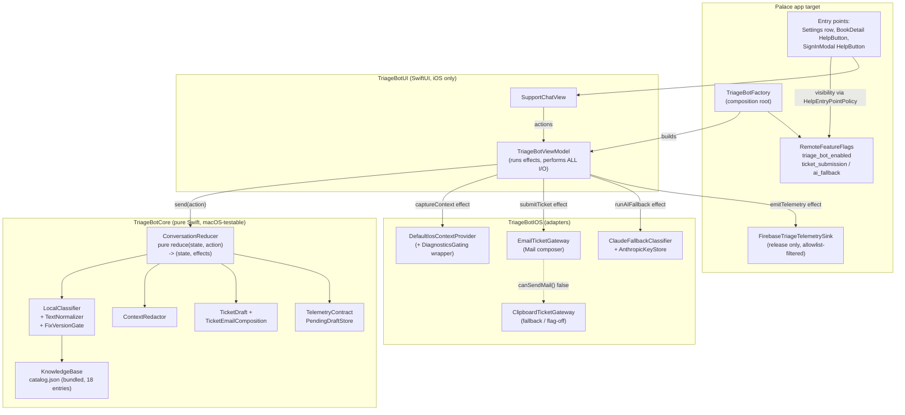
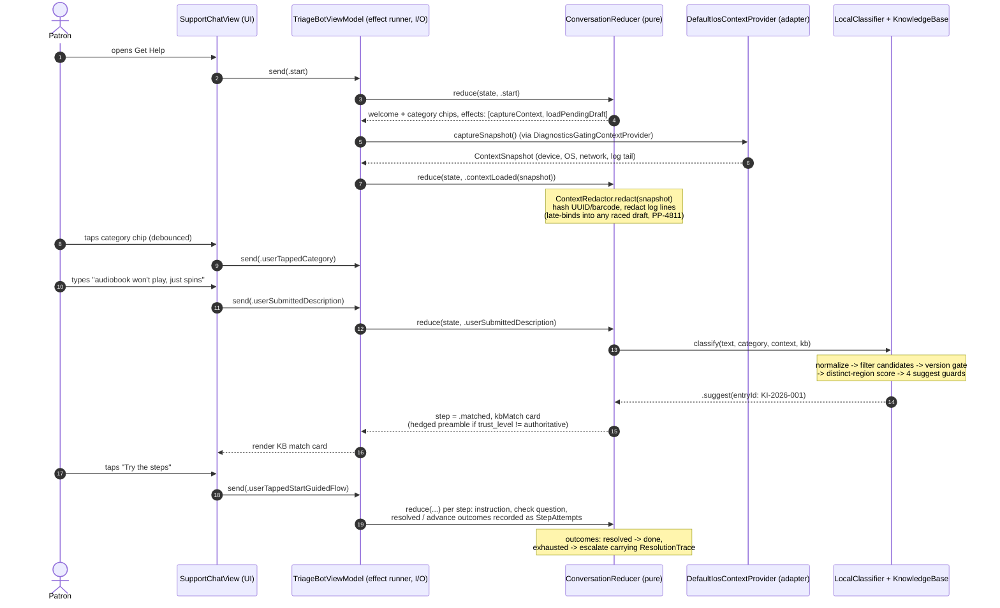
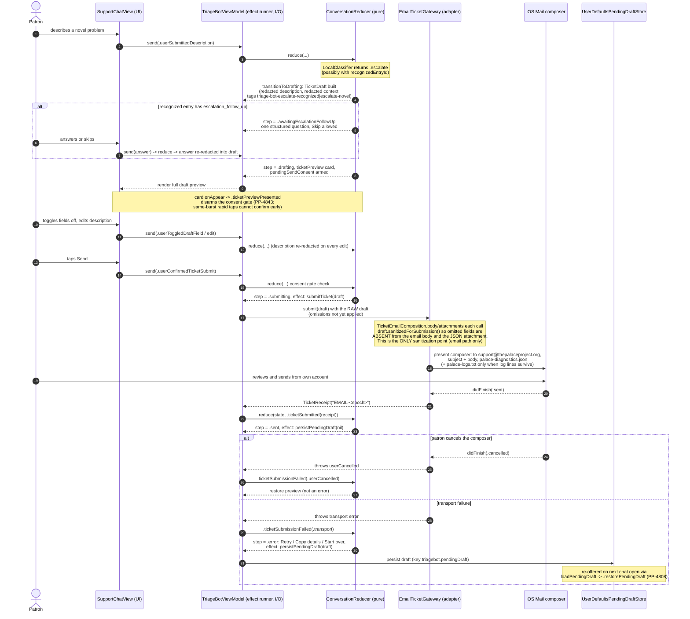
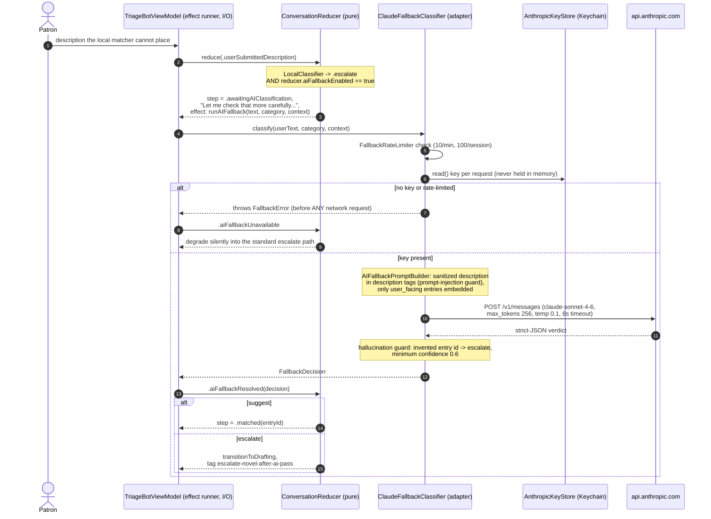

<!-- audit-verified: all file/line citations checked against the working tree 2026-07-28; catalog stats recomputed from catalog.json; test counts recomputed via grep (re-verified 2026-07-29: 293 tests across 40 files, Core 285 across 37; ResponseQuality corpus 70 Case literals, the 71st grep hit being the substring in testEveryCatalogEntry_hasABenchmarkCase); commit SHAs daadfc696/defb3abe6/d465a6b07/2613ed069 and dates verified via git log; PP/ticket ids and plan line refs carried from the PP-4858 verified analysis report. Cold-review pass re-verified at source 2026-07-28: 15 redaction patterns + 2 phase-3 helper regexes; 29 action cases; 7 explicit Date() sites in reduce; duplicate_of filtered at query time in entries(in:) only; clipboard path receives the raw (unsanitized) draft; palace-logs.txt conditional; test targets Swift 5 mode; region merge is strict-overlap; chip labels come from KBCategory.displayName -->

# Palace Triage Bot V1

Technical documentation for the Palace triage bot: what it does, the behavioral contracts any implementation must reproduce, and where each piece lives in the iOS reference implementation. Written for engineers implementing the Android client or the shared server components, and for anyone maintaining the iOS bot.

The iOS implementation is the reference implementation. Sections describing behavior (the classifier, redaction, the corpus schema, the escalation state machine) define the contract; footnoted citations point at the Swift code that realizes it. Detail that is platform-specific is labeled as such so nobody ports it by mistake. The companion document `triage-bot-shared-architecture-proposal.md` designs the future shared architecture and describes what changes under it.

File paths are relative to the repo root; the package root `Palace/Packages/PalaceTriageBot/` is abbreviated `PKG/`.

> Where code comments and this document disagree, this document is correct. Several load-bearing comments are stale, and a code-first reader will build the wrong model from them. Known-stale as of 2026-07-28: `LocalClassifier.swift:6-10` still describes the retired raw-count scoring (actual scoring is by distinct match regions, [section 3.3](#33-scoring-distinct-match-regions-not-raw-hits)); the comment on `LocalClassifier.distinctMatchRegionCount` says touching ranges merge (they do not, [section 3.3](#33-scoring-distinct-match-regions-not-raw-hits)); the `KnowledgeBase.entries(in:)` comment claims `wontfix` entries are hidden (the code checks only `duplicate_of`); `PKG/Package.swift` claims every Core type has a 1:1 Kotlin analogue (no Kotlin exists); and comments in `ConversationReducer.swift:948-950`, `Protocols/Protocols.swift:11-14`, and `Palace/FeatureFlags/RemoteFeatureFlags.swift` describe a HelpSpot HTTP POST that has never existed (the only gateways are email and clipboard).

## At a glance

- **What it is.** An on-device support assistant. A patron opens Get Help, picks a category, describes the problem; the bot either answers from a curated local knowledge base (optionally walking them through recovery steps), or drafts a support ticket the patron reviews field by field and sends by email.
- **Three layers, one SPM package.** `TriageBotCore` (portable business logic: reducer, classifier, redactor, KB, ticket models), `TriageBotIOS` (platform adapters), `TriageBotUI` (SwiftUI chat). The app wires them in `Palace/Support/TriageBotFactory.swift`.
- **The concepts to hold in your head.** The pure reducer decides and the ViewModel performs all I/O ([section 2](#2-component-architecture)); the classifier is pure, deterministic, and scores by distinct match regions ([section 3](#3-the-pattern-matching-engine)); the corpus is one bundled JSON file updated editorially ([sections 5](#5-the-local-corpus)-[6](#6-how-the-corpus-gets-updated)); redaction runs before anything leaves the device ([section 8](#8-privacy-and-redaction)).
- **What an alternate implementation reproduces.** The classifier ([section 3](#3-the-pattern-matching-engine)), the redaction rules ([section 8](#8-privacy-and-redaction)), the corpus schema ([section 5](#5-the-local-corpus)), and the draft/consent flow ([section 7](#7-the-escalation-path)). The conformance corpora live in the test suites ([section 9](#9-test-posture)).
- **Status.** iOS only, 18 KB entries, master flag off in release, no production traffic ([section 11](#11-status)).
- **For a decision-maker.** The two sections you need are at the end: [section 11 (Status)](#11-status) for what is real today and [section 12 (Known gaps)](#12-known-gaps-and-open-questions) for what is not. Read those two first.

## Contents

- [1. Patron experience](#1-patron-experience)
- [2. Component architecture](#2-component-architecture)
- [3. The pattern-matching engine](#3-the-pattern-matching-engine)
- [4. Sequence diagrams](#4-sequence-diagrams)
- [5. The local corpus](#5-the-local-corpus)
- [6. How the corpus gets updated](#6-how-the-corpus-gets-updated)
- [7. The escalation path](#7-the-escalation-path)
- [8. Privacy and redaction](#8-privacy-and-redaction)
- [9. Test posture](#9-test-posture)
- [10. The AI fallback](#10-the-ai-fallback)
- [11. Status](#11-status)
- [12. Known gaps and open questions](#12-known-gaps-and-open-questions)
- [Appendix: design notes](#appendix-design-notes)

---

## 1. Patron experience

A patron opens Get Help from Settings, or taps a Help button on the book detail screen or the sign-in sheet. A chat surface greets them with six category chips, labeled Audiobook, Reading, Sign in, Download, Library, Other (labels come from `KBCategory.displayName`, so chip wording and the ticket preview's Category field share one source; the id-to-label mapping is in [section 5](#5-the-local-corpus)). They pick one, describe the problem in their own words, and one of three things happens:

1. **Known issue or FAQ recognized.** A card shows the curated workaround or answer. Known issues with multi-step recovery offer a guided walkthrough: try step 1, "did that fix it?", advance or resolve, each outcome recorded.
2. **The bot is not confident.** It drafts a support ticket instead of guessing. The patron sees the complete draft (their description, app/OS/device context, redacted recent logs), can toggle individual fields off, edit the description, and then explicitly sends it. Nothing leaves the device without that review.
3. **Topic recognized, no self-serve fix.** The bot escalates with the recognized entry attached, asks one targeted follow-up question first (skippable), and tags the ticket so support starts with context.

Sending opens the iOS Mail composer pre-addressed to `support@thepalaceproject.org` with the report body and up to two attachments ([section 7](#7-the-escalation-path)). The patron sends from their own mail account; the app never sends anything programmatically. A failed send is saved as a draft and re-offered the next time they open the chat.

Classification runs entirely on-device against a bundled knowledge base. In App Store builds no network call is made ([section 10](#10-the-ai-fallback)).

---

## 2. Component architecture

One SPM package with three products split by portability, plus one app-side wiring point. Package manifest: `PKG/Package.swift`, Swift 6 language mode on all source targets, platforms iOS 17 / macOS 12; the app target is also iOS 17 minimum.[^pkg-manifest]

| Product | Role | Platform coupling |
|---|---|---|
| **TriageBotCore** | All business logic: KB schema and index, `LocalClassifier`, `TextNormalizer`, `ConversationReducer` and state model, `ContextRedactor`, ticket draft/composition models, telemetry contract, rate limiter, AI prompt builder, protocol seams. No UIKit, SwiftUI, or Firebase; compiles and tests on macOS via `swift test`. | Portable by contract,[^pkg-manifest] not shared code. No Kotlin exists; an Android port mirrors this layer. Residual Apple couplings: [section 12](#12-known-gaps-and-open-questions), item 11. |
| **TriageBotIOS** | Platform adapters behind `#if canImport(UIKit)`: `DefaultIosContextProvider` (system snapshot + log tail), `EmailTicketGateway` (Mail composer), `ClipboardTicketGateway`, `ClaudeFallbackClassifier`, `AnthropicKeyStore` (Keychain), `OSLogTelemetrySink`. | iOS only. Android reimplements these against the same Core protocols. |
| **TriageBotUI** | SwiftUI chat surface: `SupportChatView`, `TriageBotViewModel` (the effect runner), category chips, chat bubbles, KB match card, guided step card, ticket preview card. | iOS only. |

**Composition root.** `Palace/Support/TriageBotFactory.swift` is the single place the bot is wired into Palace.

<details><summary>Reference: composition-root wiring (platform-specific, iOS)</summary>

- Loads the bundled catalog synchronously via `BundledCatalogSource.loadCatalogSync()`; on failure the host view shows an explicit unavailable state, never a blank screen.[^catalog-load]
- Decides AI wiring via the pure invariant `TriageBotAIWiring.aiWiring(flagEnabled:keyPresent:)`: the Claude classifier is injected only when the remote flag is on AND a Keychain key exists.[^ai-wiring]
- Selects the ticket gateway by flag: `EmailTicketGateway` (with clipboard fallback) when submission is enabled, `ClipboardTicketGateway` alone when off.[^factory-wiring]
- Injects Palace context fields: `libraryName`/`libraryUUID` from the current account, raw `barcode` (hashed immediately by the redactor). `distributor: nil` and `authType: nil` are hardcoded with "Phase 2" comments, so those KB filters never engage in production.[^factory-wiring] Consequences in [section 5](#5-the-local-corpus) and [section 12](#12-known-gaps-and-open-questions).
- Selects the telemetry sink: `OSLogTelemetrySink` in DEBUG, `FirebaseTriageTelemetrySink` in release, the latter filtering every event through the enumerable-keys-only `TelemetryContract`.[^telemetry-sinks]

</details>

**Entry points.**

- Settings Support row via `SupportSectionDecision`; with the bot flag off it falls back to the legacy support email, so the section is never empty.[^settings-entry]
- `HelpButton` on the book detail screen and the sign-in modal, visibility resolved through the pure `HelpEntryPointPolicy`.[^help-buttons]
- The email transport is one-way: there is no notification-tap entry into a ticket thread.

**Feature flags.**[^flags]

| Flag | Effect | Default (TestFlight/App Store) | Default (DEBUG) |
|---|---|---|---|
| `triage_bot_enabled` | Master kill-switch; when off, every entry point is invisible | OFF | ON |
| `triage_bot_ticket_submission_enabled` | Email gateway vs clipboard-only | OFF | ON |
| `triage_bot_ai_fallback_enabled` | Permits the Claude fallback (still requires a device key) | OFF | ON |

Override precedence for each flag, highest first: UserDefaults local override, then the DEBUG-build default (ON), then Firebase Remote Config.[^flags]

<details><summary>Reference: QA affordances (platform-specific, iOS)</summary>

A fourth, DEBUG-only override (`TriageBotForceSubmitFailure`) swaps in an always-failing gateway so the error/retry UI is reachable on simulators where the clipboard gateway would otherwise always succeed.[^flags] Developer Settings exposes four toggles plus an "Anthropic API Key" row driven by `TriageBotKeyAdmin`.[^dev-settings]

</details>

### Component diagram



### The effect-execution boundary

> **Note.** The reducer decides; the ViewModel performs. `ConversationReducer.reduce(state, action)` is a pure function returning a new state plus descriptive `ConversationEffect` values. `TriageBotViewModel.apply(_:)` is the only place effects become I/O, and every I/O result comes back into the reducer as another action.[^effect-boundary] This boundary appears in every sequence diagram in [section 4](#4-sequence-diagrams) and is the design decision an alternate implementation should copy first.

The package carries its own minimal loop and deliberately does not import Palace's app-side `Store` ([design notes](#appendix-design-notes)).[^effect-boundary]

The 6 effects, and the actions their I/O results re-enter the reducer as:[^effect-boundary]

| Effect | Performed by the ViewModel as | Result action(s) |
|---|---|---|
| `captureContext` | context provider snapshot | `.contextLoaded` |
| `submitTicket(TicketDraft)` | ticket gateway submit | `.ticketSubmitted` / `.ticketSubmissionFailed` |
| `runAIFallback(...)` | Claude fallback classify | `.aiFallbackResolved` / `.aiFallbackUnavailable` |
| `loadPendingDraft` | pending-draft store read | `.restorePendingDraft` |
| `persistPendingDraft(...)` | pending-draft store write | none |
| `emitTelemetry(...)` | telemetry sink | none |

The state model defines 12 conversation steps, 29 action cases, and 7 message kinds.[^state-model]

<details><summary>Reference: the 12 conversation steps</summary>

Conversation steps:[^state-model]

| Step | Meaning |
|---|---|
| `welcome` | greeting rendered |
| `awaitingCategory` | category chips shown |
| `awaitingDescription` | waiting for the patron's free-text description |
| `awaitingFollowUp` | vestigial; never set by the reducer |
| `awaitingAIClassification` | AI fallback in flight |
| `matched` | KB match card shown |
| `guidedStep` | guided walkthrough in progress |
| `awaitingEscalationFollowUp` | one structured pre-ticket question pending |
| `drafting` | ticket preview shown, consent gate armed |
| `submitting` | submitTicket effect in flight |
| `sent` | receipt confirmed |
| `error` | transport failure; Retry / Copy details / Start over |

</details>

---

## 3. The pattern-matching engine

This section is a behavioral contract: an alternate implementation must reproduce it exactly, and the conformance corpora in [section 9](#9-test-posture) are the check. `LocalClassifier.classify` is a pure, deterministic function: user text + optional category + optional context snapshot + the KB in, a `ClassificationResult` out (decision, confidence, matched keywords, considered entry ids, optional recognized entry id).[^classifier-entry]

### 3.1 Normalization

Both the patron's text and every keyword fold through `TextNormalizer.normalize`: lowercase, then fold three curly-apostrophe variants (U+2019, U+2018, U+02BC) to `'` and six hyphen/dash variants (U+2010, U+2011, U+2012, U+2013, U+2014, U+2212) to `-`.[^normalizer]

Rationale: mobile keyboards type curly apostrophes by default. Without normalization, "won't play" typed on a device matches neither the ASCII keyword "won't play" nor the apostrophe-free "wont play", so every apostrophe-bearing keyword is unreachable and recall collapses silently (ASCII-typed unit tests keep passing).[^normalizer] Normalization applies to both sides of every comparison so the two spaces always agree.

String semantics an alternate implementation must match exactly (this is the same silent-recall-collapse class as PP-4825: ASCII-only tests keep passing while real input goes dark):

- **Case folding is locale-independent** Unicode default lowercasing (Swift `lowercased()`). A locale-sensitive fold breaks the contract: a naive Kotlin `toLowerCase()` on a Turkish-locale device maps I to dotless ı, so "SIGN IN" folds to "sıgn ın" and every sign-in keyword stops matching. Use `lowercase(Locale.ROOT)` or the platform's locale-free equivalent.
- **Substring matching honors Unicode canonical equivalence** on iOS: both the `contains` check and the first-occurrence lookup go through Foundation's `range(of:)`, so composed and decomposed forms of the same character match. Kotlin's `String.contains` compares code units exactly. A conformant port must either NFC-normalize both sides before matching or use a canonical-equivalence search.
- **Match positions live in one consistent index space** over the normalized text (the iOS implementation compares string positions returned by the Foundation search). The merge rule that consumes those positions is specified in [section 3.3](#33-scoring-distinct-match-regions-not-raw-hits); what matters for conformance is that both the positions and the comparisons use the same unit, whichever the platform picks.

### 3.2 Candidate filtering

With a category selected, candidates are `kb.entries(in: category)` filtered by `passesContextFilters`: an entry with `distributor_filter` or `auth_type_filter` is excluded when the context has a value not in the filter list. A nil context value passes every filter (this matters: production passes nil for both, [section 5](#5-the-local-corpus)), and an absent snapshot behaves exactly as a snapshot whose every field is nil, including for the version gate's app version below. Without a category, `kb.entries(matching: context)` runs the same context filters over the whole catalog.[^context-filters]

Status filtering is asymmetric and happens at query time, not on load: the category-scoped `entries(in:)` drops `duplicate_of` entries; the category-less `entries(matching:)` applies no status filter at all.[^context-filters] No shipped entry uses `duplicate_of`, but the first one added would still be classifiable whenever the patron's path skips the category (and `wontfix` is not filtered on either path, despite a code comment claiming otherwise).

**Version gate:** a known-issue entry with `status: fixed_in` is dropped when `FixVersionGate.userAlreadyHasFix` (component-wise `SemanticVersion` compare) says the user's app version is at or past the fix.[^version-gate] The gate applies to the candidate set from either path, category-scoped or category-less, and runs after the context filters. Rationale: a user on the fix version still hitting the symptom is a regression candidate that should escalate, not be told a stale workaround. How_to entries always pass; a "how do I renew?" answer never expires against a build number.

`SemanticVersion` parse and compare rules, which a port must reproduce exactly because a wrong compare silently resurfaces (or suppresses) fixed-in entries:[^version-gate]

- **Parse:** trim whitespace, lowercase, then remove every letter "v" (not just a leading one), split on "." dropping empty components. If no components remain (inputs like "v" or ".."), the parse fails. The first component must parse as an integer or the whole parse fails (returns nil); a component parses only as an optional sign followed by ASCII digits, matching Swift `Int.init(String)` semantics ("3 " and "3_0" are nil), so a more lenient parser silently flips the fail-open gate. A second or third component that is present but non-numeric coerces to 0, so a pre-release suffix silently drops: "3.2.0-beta1" parses as 3.2.0 and reads as the release. Missing components are 0 ("3.2" equals "3.2.0"). Components past the third are ignored ("3.2.0.1" parses as 3.2.0).
- **Compare:** numeric, component-wise, major then minor then patch. Never lexicographic and never string-numeric ("3.10.0" is greater than "3.2.0").
- **Gate:** suppress the entry when user version is greater than or equal to the fix version. Any parse failure on either side, a missing app version, or a `fixed_in` entry with no `fixed_in_version` fails open: the entry stays visible.

### 3.3 Scoring: distinct match regions, not raw hits

For each candidate, the matched keywords are those whose normalized form is a substring of the normalized text. Substring means plain containment with no word-boundary requirement, and conformance depends on that: `stalled` matches inside `uninstalled`, which is the second distinct region that lifts the shipped quality case "audiobooks won't download after I uninstalled and reinstalled and rebooted" over KI-008's two-region floor. A word-bounded search fails there. The score is NOT the raw hit count. Instead, `distinctMatchRegionCount` counts distinct match regions:[^region-scoring]

1. For each matched keyword, take its FIRST occurrence range in the normalized text (later occurrences never contribute).
2. Sort the ranges by start position.
3. Walk in order, tracking the current cluster's end. A range that starts at or past the current end starts a NEW cluster. A range that starts before the current end merges into the cluster and may extend its end.
4. The cluster count is the region count.

Note the boundary rule in step 3: only strictly overlapping ranges merge. Two ranges that merely touch end-to-start count as two regions. (The code comment on this function says "overlapping/touching" merge; the code merges only strict overlaps, and this document describes the code.) The sort's tie-break at equal start positions is unspecified and immaterial for nonzero-width ranges, since equal-start ranges always merge. Empty-string keywords are undefined behavior with no shipped data (the iOS counter skips them).

Score = `min(regions / 3.0, 1.0)`, saturating at 3 regions, so scores are quantized to {1/3, 2/3, 1.0}.

**Integer-division warning.** `regions / 3` must be a floating-point division. Transliterated with an integer type it silently yields {0, 0, 1} for 1, 2, 3 regions instead of {1/3, 2/3, 1}, which changes the threshold guard and the runner-up-saturation guard while casual testing still looks fine (3-region matches still suggest). Expected scores:

| Distinct regions | Score |
|---|---|
| 1 | 1/3 (0.333...) |
| 2 | 2/3 (0.666...) |
| 3 | 1.0 |
| 4+ | 1.0 (saturated) |

> **Note.** Distinct-region scoring is the classifier's precision guard. Entries list nested synonym variants ("hang", "hangs", "won't play", "wont play"); a single word substring-matches every variant, and a raw count inflates until one word alone clears the confidence bar. Merging overlapping ranges collapses the synonyms to concepts: a concept mentioned once counts once, however exhaustive the entry's synonym list. Saturation at 3 makes a 3-concept hit maximally confident without rewarding keyword-stuffed entries.

### 3.4 The four suggest guards

Candidate ordering: all surviving candidates (including zero-scoring ones) are ranked by score descending. On equal scores the iOS implementation preserves catalog order (Swift's sort is stable in the current toolchain, though the language does not contractually guarantee it); a conformant implementation must use a stable descending-score sort over catalog order, and `ResponseDeterminismTests` pins the resulting byte-identical output. The "runner-up" is simply the second-ranked candidate, zero-scoring or not. When only one candidate exists, the runner-up is treated as score 0 with 0 regions, so guards 3 and 4 below pass vacuously.

The top-ranked candidate is suggested only when ALL of these hold:[^suggest-guards]

1. `top.score >= entry.confidenceThreshold`. Because scores are quantized, a threshold in (1/3, 2/3] means "require at least 2 regions" and (2/3, 1.0] means "require at least 3". Shipped entries carry thresholds of 0.08-0.1, i.e. at the kind floor; the knob exists for a future entry broad enough to need 3 regions.
2. `top.distinctCount >= minDistinctRegions`, the per-kind floor: **2 for known_issue**, **1 for how_to**.[^suggest-guards] Rationale: a single symptom word like "stuck", or "my library" in a generic complaint, is too weak alone to route a patron to a specific bug workaround, so single-region inputs escalate instead (and, where enabled, reach the AI fallback for a semantic second opinion). How_to entries carry multi-word intent phrases ("switch library", "return early") disjoint from symptom language, so one strong intent match is a confident signal; requiring two would make most FAQ phrasings escalate. The multi-word property is test-enforced so a bare word like "renew" cannot fire on "renewed my card".[^howto-multiword]
3. `matchCountMargin >= 1`: the top must lead the runner-up by at least one distinct region. Despite the identifiers, `matchCountMargin` and guard 2's `distinctCount` both operate on distinct match regions ([section 3.3](#33-scoring-distinct-match-regions-not-raw-hits)), never on raw matched-keyword count; the names are historical, and the two readings diverge whenever nested synonym variants merge, so implement the region reading. (An earlier score-margin disjunct is provably dead under quantized scores and was removed.[^suggest-guards])
4. Runner-up score `< 0.8`: when both leading entries are at or near saturation (a description stuffed with keywords from multiple entries), that is genuine ambiguity, and the classifier disambiguates rather than confidently picking one.

### 3.5 Decision precedence

The full decision order, exactly as evaluated:[^below-guards]

1. **No candidates after filtering:** `.escalate` blank (confidence 0, empty considered-ids).
2. **Candidates exist but the top score is 0:** `.escalate` blank, carrying the considered-ids.
3. **All four guards pass:** if the top entry sets `escalate_anyway`, return `.escalate` carrying `recognizedEntryId`; otherwise `.suggest`. `escalate_anyway` is checked strictly after the guards, so it fires only on matches that would have been confident suggestions. It exists for problem classes with no safe self-serve fix; the code path is tested but no shipped entry sets it.
4. **Guards failed, and at least 2 of the top 3 ranked candidates scored above zero:** `.disambiguate(candidates:)`, carrying exactly those positive-scoring ids (2 or 3 of them) in rank order.
5. **Otherwise (a single positive-scoring match that failed the guards):** `.escalate` carrying `recognizedEntryId`, so the escalation asks that entry's targeted follow-up question and tags the ticket.

Two result fields the arms share. `confidence` is 0 in the two blank-escalate arms and the top candidate's score everywhere else: suggest, disambiguate, and both escalate-with-recognition variants (arms 3 and 5). `consideredEntryIds` is empty in arm 1 and otherwise lists every candidate that survived the context filters and the version gate, including zero-scoring ones, in catalog order, not rank order. <!-- audit-verified: arms/confidence/consideredEntryIds/prefix(3) checked against LocalClassifier.swift classify() 2026-07-29 -->

Disambiguation handling is shallow: the reducer asks one canned question ("Is this happening right now, or did it happen earlier today?"), stays in the same step, and the patron's next message simply re-classifies from scratch. The `.userAnsweredFollowUp` action is an explicit no-op stub.[^below-guards] There is no round cap: the classifier is deterministic, so resubmitting identical text disambiguates forever. The flow exits only when a later message classifies to suggest or escalate, or the patron takes a different action.

---

## 4. Sequence diagrams

In all three, note the boundary: the Reducer only ever computes state and emits effect descriptions; the ViewModel is the only actor that touches providers, gateways, or the network.

### 4.1 KB hit (local match, guided flow available)



Alternatives from the match card: "File a ticket anyway" drafts a low-priority ticket carrying the matched entry id.

A "Notify me when fixed" affordance is not rendered: `KBMatchActionPolicy.showsNotifyMeOnFix` returns false because no delivery mechanism exists ([section 12](#12-known-gaps-and-open-questions)). The reducer's handler survives behind it, producing a synthetic local receipt `notify-<entryId>` and a confirmation message only.[^notify-stub] That receipt is deliberately stamped with `Self.syntheticReceiptTimestamp` (epoch 0), never the current time: `ResponseDeterminismTests` pins byte-identical responses, so "improving" it with a wall-clock timestamp breaks that suite for reasons the diff alone will not explain. Only real gateway receipts carry real times.

### 4.2 Escalation to a support ticket (AI off, the App Store path)



When `canSendMail()` is false or no presenter exists, `EmailTicketGateway` falls back to `ClipboardTicketGateway`, which copies the JSON payload to the pasteboard and returns a `DEMO-CLIPBOARD-<epoch>` receipt.[^clipboard-fallback] With the submission flag off (the production default), the clipboard gateway is the only gateway.

**The clipboard path skips omission sanitization.** The reducer emits the raw draft (`ConversationReducer.swift:516, 633`), the ViewModel forwards it untouched (`TriageBotViewModel.swift:62-64`), and `sanitizedForSubmission()` runs only inside `TicketEmailComposition.body/attachments` (`TicketEmailComposition.swift:31, 105`). `ClipboardTicketGateway.submit` (`ClipboardTicketGateway.swift:17-30`) JSON-encodes the draft it receives directly, so on the production-default path and on the `canSendMail()` fallback, patron field omissions (including the omit-by-default barcode hash and toggled-off logs) are present in the pasteboard payload. Content-level redaction has already run, so no raw secret leaks; the omission consent is what goes unhonored. Tracked as [section 12](#12-known-gaps-and-open-questions), item 12.

There is no HelpSpot API gateway anywhere in the tree; receipt ids are synthesized locally and `helpspotTags` ride inside the JSON attachment. The seam comment at `PKG/Sources/TriageBotIOS/ClipboardTicketGateway.swift:12-13` marks where a `HelpSpotTicketGateway` would slot in.

### 4.3 AI fallback (flag and key gated, inert in App Store builds)



Any failure on this path (missing key, rate limit, timeout, parse failure) degrades silently into the standard escalation flow; the patron never sees an AI error.[^ai-degrade]

---

## 5. The local corpus

The corpus is a single bundled JSON file, `PKG/Sources/TriageBotCore/Resources/catalog.json`, decoded through `KBEntry` (snake_case CodingKeys).[^kbentry-schema] Any implementation consumes the same file and schema. Catalog `v1.2-2026-07-20` ships:

- 18 entries: 9 known_issue, 9 how_to. Ids are slugged, e.g. `KI-2026-001-audiobook-first-open-hang`, `HT-2026-001-renewals`; prose in this document uses the short forms (KI-001, HT-001).
- Categories: other 7, library 5, audiobook 3, reader 1, signin 1, download 1.
- Known-issue statuses: 4 `open`, 4 `fixed_in`, 1 `user_error`. Trust levels: 16 `authoritative`, 1 `signal`, 1 `context`. 7 entries carry an `escalation_follow_up` question. All 18 are `visibility: user_facing`.

### Corpus schema

Top-level document shape, all three fields required:

```json
{ "version": "v1.2-2026-07-20", "updated_at": "2026-07-20", "entries": [ ... ] }
```

Entry fields. "Required" means the decode fails without it (Swift synthesized Codable: a non-optional field has no decode-time default even where the memberwise initializer has one).

| Field | Type | Required |
|---|---|---|
| `id` | string | yes |
| `category` | enum (below) | yes |
| `kind` | enum (below) | no; absent decodes as `known_issue` |
| `status` | enum (below) | no; present on all shipped known_issue entries, absent on how_to |
| `fixed_in_version` | string version | no |
| `symptom_keywords` | array of string | yes |
| `distributor_filter`, `auth_type_filter`, `ios_version_filter` | array of string | no |
| `user_facing_workaround` | string | yes (for how_to it holds the answer text) |
| `user_facing_steps` | array of step objects (below) | no |
| `escalation_follow_up` | object (below) | no |
| `internal_reference` | object: `jira` string?, `wall_failure` string?, `helpspot` array of int? | no |
| `confidence_threshold` | number | yes |
| `escalate_anyway` | bool | yes |
| `helpspot_tag` | string | no (present on all 18 shipped entries) |
| `trust_level` | enum (below) | yes |
| `visibility` | enum (below) | yes |
| `ui_surface` | string | no; governance tests require it on how_to entries |
| `reviewed_at` | string YYYY-MM-DD | no; governance tests require it on how_to entries |

Enum value sets (JSON raw values):

- `status`: `open`, `fixed_in`, `wontfix`, `duplicate_of`, `user_error`
- `kind`: `known_issue`, `how_to`
- `trust_level`: `authoritative`, `signal`, `context`
- `visibility`: `user_facing`, `internal_only`
- `category`: `audiobook`, `reader`, `signin`, `download`, `library`, `other`

Category ids are NOT the chip labels. The mapping (source of truth: `KBCategory.displayName`, shared by the chips and the ticket preview) is `audiobook` = "Audiobook", `reader` = "Reading", `signin` = "Sign in", `download` = "Download", `library` = "Library", `other` = "Other".

`user_facing_steps` element shape: `id` (string, required), `instruction` (string, required), `check` (string, required), `responses` (optional array of `{label: string, outcome: "resolved" | "advance" | "escalate", diagnostic: string?}`; when absent the UI renders a legacy Yes/No pair), `diagnostic` (string, optional telemetry tag).

`escalation_follow_up` shape: `prompt` (string, required), `placeholder` (string, optional input hint), `diagnostic` (string, optional telemetry tag).

A complete worked example (a shipped how_to entry, workaround text abridged; known_issue entries additionally carry `status`, and optionally `fixed_in_version`, `distributor_filter`, `user_facing_steps`, `escalation_follow_up`; see `KI-2026-001-audiobook-first-open-hang` in the catalog for a maximal one):

```json
{
  "id": "HT-2026-001-renewals",
  "category": "other",
  "kind": "how_to",
  "symptom_keywords": ["renew my loan", "renew the loan", "renew my book", "renew a book",
    "renew my checkout", "how do i renew", "can i renew", "extend my loan", "extend the loan",
    "extend my checkout", "keep the book longer", "keep it longer", "borrow it again"],
  "user_facing_workaround": "Palace doesn't renew loans inside the app [...] borrow the title again from the catalog. If someone else has it on hold, place a hold to get back in line.",
  "internal_reference": { "helpspot": [18028, 18187] },
  "confidence_threshold": 0.1,
  "escalate_anyway": false,
  "helpspot_tag": "how-to-renewals",
  "trust_level": "authoritative",
  "visibility": "user_facing",
  "ui_surface": "catalog",
  "reviewed_at": "2026-07-20"
}
```

### Field semantics

| Field | Consumed by | Effect |
|---|---|---|
| `symptom_keywords` | classifier | the match surface ([section 3](#3-the-pattern-matching-engine)) |
| `category`, `kind` | classifier | candidate scoping; per-kind suggest floor |
| `status` + `fixed_in_version` | classifier | version gate[^version-gate] |
| `distributor_filter`, `auth_type_filter` | classifier | context filters;[^context-filters] see the caveat below |
| `confidence_threshold` | classifier | per-entry guard 1 |
| `escalate_anyway` | classifier | recognized-but-escalate path |
| `user_facing_workaround`, `user_facing_steps` | reducer/UI | match card text; guided flow steps |
| `escalation_follow_up` | reducer/UI | the one pre-ticket question (PP-4832) |
| `helpspot_tag` | reducer | a tag string inside the draft |
| `trust_level` | reducer | sole distinction: not `authoritative` gets a hedged preamble[^trust-hedge] |
| `visibility` | AI prompt builder only | non-`user_facing` entries excluded from the Claude prompt;[^visibility-ai] moot while all entries are user_facing |
| `ui_surface`, `reviewed_at` | governance tests only | staleness gate (below) |

### Schema headroom no shipped entry exercises

Several capabilities exist in code but are exercised by zero shipped data. Evaluate the engine on what data exercises, not on what the schema permits.

- `auth_type_filter` and `ios_version_filter`: defined, decoded; no entry sets either. `ios_version_filter` is additionally never read by any code path.[^kbentry-schema]
- `escalate_anyway`: false on all 18 entries; the code path is data-unreachable.
- `distributor_filter` is set on KI-001/002/007 (`palace_marketplace`) but cannot engage in production, because the app passes `distributor: nil`[^factory-wiring] and a nil context field passes every filter. The marketplace scoping on those entries is decorative on device.
- `internal_reference` (jira / wall_failure / helpspot id arrays): provenance for humans; never read by code.
- `KBStatus.wontfix` and `.duplicateOf`: no entries. `duplicate_of` is filtered at query time, and only on the category-scoped `entries(in:)` path; the category-less path and `wontfix` are not filtered at all ([section 3.2](#32-candidate-filtering)).[^kbentry-schema]
- `TicketPriority.high` is defined but never assigned (drafts are `.low` on file-anyway, `.normal` on escalations).

### Staleness governance

Two mechanisms, both in-repo and test-enforced:

- **Known issues:** the `FixVersionGate` auto-suppresses `fixed_in` entries for users on or past the fix version, and a lint test pins the status/fix-version consistency class.[^staleness-tests]
- **How_to entries:** every how_to must declare `ui_surface` and `reviewed_at`. A hand-maintained map of UI surface to last-changed date (4 surfaces) fails the suite when any how_to was reviewed before its anchored surface last changed, or anchors to an unknown surface.[^staleness-tests]

This is deliberate but small-scale: the change log is a literal dictionary inside a test file, and it scales with editorial discipline, not automation ([section 12](#12-known-gaps-and-open-questions)).

---

## 6. How the corpus gets updated

There is no automated scrape-to-corpus pipeline. Corpus update is a manual, human-in-the-loop editorial process, and shipping a corpus change requires an app release. A shared-architecture decision hinges on this. The editorial loop:

1. The person curating the corpus reads real HelpSpot tickets and identifies recurring symptom clusters and FAQ intents.
2. They hand-edit `catalog.json`: new or revised entries, keyword lists written against real patron phrasing, `version` and `updated_at` bumped, `reviewed_at` set on touched how_to entries.
3. Provenance is pinned in each entry's `internal_reference` ids (for example KI-001 cites HelpSpot tickets 17964, 17929, 17989, 17959). This is for humans auditing "why does this entry exist"; code never reads it.
4. The change must pass the in-repo quality gates: `CatalogSchemaLintTests`, `HowToGovernanceTests`, `ResponseQualityTests` (with its named-miss allowlists, [section 9](#9-test-posture)), and `HoldoutGeneralizationTests`.
5. It ships as a normal PR and reaches patrons only in the next App Store release, because the catalog is a bundled resource.[^curation-history]

What does not exist:

- No scheduled HelpSpot mining job feeding the catalog.
- No KB authoring tool for support staff.
- No server hot-update path. The `KnowledgeBaseSource` protocol seam for a server-backed catalog exists,[^kb-source-seam] but its only implementations are `BundledCatalogSource` and the tests' in-memory source.
- `scripts/triage-corpus-check.sh`, despite the name, is a redaction leak gate ([section 8](#8-privacy-and-redaction)), not KB tooling.

The release-cadence and curation-bottleneck consequences are what `triage-bot-shared-architecture-proposal.md` addresses.

---

## 7. The escalation path

### Draft assembly

`transitionToDrafting` / `escalateWithTrace` build a `TicketDraft`:[^draft-assembly]

| Field | Content | Rules |
|---|---|---|
| `userDescription` | the patron's text | redacted at assembly; re-redacted on every subsequent edit and follow-up answer, so a credential typed into an edit cannot slip past a one-time pass[^draft-assembly] |
| `category` | selected category | falls back to `.other` |
| `matchedEntryId` | the bot's best-guess entry | carried even on escalation so support sees it |
| context | redacted `ContextSnapshot`, 20 fields: app/OS/device, network state, free storage, log tail, audio route, low-power mode, uptime, build channel, memory, hashed library ids[^snapshot-fields] | field-level omission honored at email serialization only (see below) |
| `helpspotTags` | `triage-bot-<suffix>` (`escalate-recognized`, `escalate-novel`, `escalate-novel-after-ai-pass`, ...), the matched entry's `helpspot_tag`, guided-flow outcome tags, follow-up answered/skipped markers | ride inside the JSON attachment; never reach any HelpSpot API |
| `priority` | `.low` for file-anyway, `.normal` for escalations | `.high` exists in the enum, unused |
| `resolutionTrace` | which guided steps were tried, with outcomes | optional |
| `escalationFollowUp` | the structured question + answer | optional; Skip allowed |
| `omittedFields` | fields the patron toggled off | barcode is omitted by default when present; the patron must opt in, and even then only the hash exists in state[^draft-assembly] |

If the recognized entry declares an `escalation_follow_up`, the flow detours to one structured question with a Skip option before the preview.[^draft-assembly]

### Preview and consent

The preview card renders the draft verbatim, with description editing and per-field include/omit toggles. The `TicketField` enum defines six omittable fields (barcode, library, network, logs, distributor, authType), and both the reducer's toggle handling and `sanitizedForSubmission()` honor all six, but the card renders toggle rows for only four: library, network, barcode, and logs. `TicketPreviewCard.swift` never references distributor or authType (both are nil in production anyway, [section 12](#12-known-gaps-and-open-questions) item 2), so an Android implementer should not build UI iOS does not have. Two protections:

- **Send-consent gate.** The normative, platform-neutral invariant: a send confirmation is accepted only after the ticket preview has actually been presented to the patron. Concretely: whenever the reducer presents a fresh preview it arms a `pendingSendConsent` flag; a confirm action that arrives while the flag is armed is discarded (it can only be a same-burst tap that raced ahead of rendering); the only thing that disarms the flag is an explicit presentation event dispatched when the preview becomes visible. On iOS that event is the card's `onAppear` dispatching `.ticketPreviewPresented`, which by construction fires on a later runloop turn than any tap burst.[^consent-gate] An implementation whose UI cannot signal actual presentation must provide an equivalent ordering guarantee, not drop the gate.
- **Omission enforced at email serialization:** `TicketDraft.sanitizedForSubmission()` rebuilds the context with omitted fields set to nil/empty, so an omitted field is absent from the email body and the JSON attachment, not merely hidden in the UI.[^sanitize-submission] The enforcement point is inside `TicketEmailComposition.body/attachments`, not the submit pipeline: the reducer and ViewModel hand every gateway the raw draft, so the guarantee holds on the email path and does NOT hold on the clipboard path ([diagram 4.2](#42-escalation-to-a-support-ticket-ai-off-the-app-store-path) and [section 12](#12-known-gaps-and-open-questions), item 12).

### Transport

With the submission flag on, `EmailTicketGateway` presents the Mail composer pre-filled with recipient `support@thepalaceproject.org`, a subject and plain-text body assembled by the pure `TicketEmailComposition`, and up to two attachments: `palace-diagnostics.json` (the full machine-readable sanitized draft, always) and `palace-logs.txt` (conditional: attached only when the sanitized draft still carries at least one log line, `TicketEmailComposition.swift:119`; an empty tail, or logs toggled off, means no logs attachment).[^email-composition] The patron reviews and sends from their own mail account; the app never sends programmatically, which is both Apple's contract for the composer and the consent model. Receipt: `EMAIL-<epoch>`, synthesized locally. Fallback and flag-off behavior: [diagram 4.2](#42-escalation-to-a-support-ticket-ai-off-the-app-store-path).

<details><summary>Reference: log capture (platform-specific, iOS)</summary>

`DefaultIosContextProvider.recentLogs()` tails `OSLogStore(scope: .currentProcessIdentifier)` filtered to the app's bundle-id subsystem, default window 30 minutes, hard cap 300 lines, each line timestamped and level-tagged.[^log-tail] Lines are redacted in the reducer at `.contextLoaded`. `crashlyticsFingerprints` is always empty: the provider hardcodes `[]`; no Crashlytics matching exists.[^log-tail] The portable contract is: a bounded, app-scoped, redact-before-attach log tail.

</details>

### Failure recovery

Gateway errors map into `userCancelled` (composer dismissed: restore the preview, not an error) versus `transport` (the `.error` state with Retry / Copy details / Start over).[^failure-mapping] On transport failure the draft is persisted via `UserDefaultsPendingDraftStore` under key `triagebot.pendingDraft` and re-offered on the next chat open. Unknown errors default to `.transport` so no failure strands the patron.[^failure-mapping]

---

## 8. Privacy and redaction

> **Note.** Redaction runs before anything leaves the device, at four points: every context snapshot before the reducer sees it, every patron-typed line at draft assembly/edit/follow-up, every captured log line, and (via `AIFallbackPromptBuilder.sanitize`) before any byte reaches Claude.[^redactor-src] The rule set below is a behavioral contract: an alternate implementation reproduces the rules and their ordering, not just the intent.

**Snapshot level:** `libraryUUID` and `libraryBarcode` are hashed via FNV-1a into an `anon-` token.[^redactor-src] The exact rule, which an implementation must match byte for byte: FNV-1a 64-bit over the raw string's UTF-8 bytes (offset basis `0xcbf29ce484222325`, prime `0x100000001b3`, wrapping 64-bit arithmetic); render the digest as lowercase hex left-zero-padded to 16 characters; the token is `anon-` plus the FIRST 8 hex characters (the most-significant 32 bits). The function is fully deterministic on input bytes, so the same input yields the same token on every platform; cross-platform equality is required: it lets support correlate reports for one account across clients, and any divergence is a conformance failure. **Gap:** nothing currently enforces that equality. `ContextRedactorTests` asserts only determinism and the `anon-` prefix; no test or fixture on any platform pins an exact digest for a known input, so a divergent Kotlin hash would pass every shipped suite. The fix is a pinned input-to-token vector in the conformance fixtures ([proposal, section 9](./triage-bot-shared-architecture-proposal.md#9-cross-platform-conformance-fixtures)). This is a non-reversible cluster id, explicitly not a cryptographic primitive. The raw barcode never lands in conversation state.

**Line level:** three phases, in order.[^redactor-src]

1. Strip Unicode bidi/RTL-override controls. Exactly these 11 scalars, removed outright (no replacement token): U+202A LRE, U+202B RLE, U+202C PDF, U+202D LRO, U+202E RLO, U+2066 LRI, U+2067 RLI, U+2068 FSI, U+2069 PDI, U+200E LRM, U+200F RLM. They can visually spoof what the patron reviews, and they can be spliced between digits to dodge the digit-run rules, so they go first.
2. Apply the 15 regex patterns below, in table order, each replacing every match in the line.
3. Long-digit-run (PAN) redaction, using two helper regexes that are not part of the phase-2 pattern list (`ContextRedactor.swift:261-269`): candidate runs match `(?<![0-9])[0-9](?:[ -]?[0-9]){12,18}(?![0-9])` (13 to 19 digits, single space or dash separators allowed between digits) and, after stripping separators, must contain 13 to 19 digits. A candidate becomes `[number-redacted]` when it is Luhn-valid OR a payment/account keyword matches inside the 24-character window immediately preceding the run (preceding only, measured in UTF-16 units). The keyword regex is `(?i)\b(card|credit|debit|visa|mastercard|amex|discover|cvv|cvc|barcode|acct|account\s+number)\b`. Replacements apply right to left so earlier match ranges stay valid. The preceding-window scoping is what lets "card" redact an adjacent mistyped card number without redacting an ISBN elsewhere on the line.

The 15 phase-2 patterns. This is the byte-for-byte contract: order, regex, and replacement all matter (fixtures compare exact output). All patterns are compiled case-insensitive in the ICU dialect (`NSRegularExpression`); `$1` is the first capture group.

| # | Label | Regex | Replacement |
|---|---|---|---|
| 1 | bearer | `(?i)\bBearer\s+[A-Za-z0-9._\-]{12,}` | `Bearer [REDACTED]` |
| 2 | basic | `(?i)\bBasic\s+[A-Za-z0-9+/=]{12,}` | `Basic [REDACTED]` |
| 3 | auth_header | `(?i)Authorization:\s*[^\s]+` | `Authorization: [REDACTED]` |
| 4 | saml_cookie | `(?i)(simpleSAMLSessionID\|PHPSESSID\|JSESSIONID)=([^;\s]+)` | `$1=[REDACTED]` |
| 5 | barcode | `(?i)\b(barcode\|card[\s_-]?number)\s*[:=]\s*\d{6,20}` | `$1=[REDACTED]` |
| 6 | pin | `(?i)\bpin\s*[:=]\s*\d{3,8}` | `pin=[REDACTED]` |
| 7 | email | `[A-Za-z0-9._%+\-]+@[^\s@]+\.[^\s@]+` | `[email-redacted]` |
| 8 | uuid | `\b[0-9a-fA-F]{8}-[0-9a-fA-F]{4}-[0-9a-fA-F]{4}-[0-9a-fA-F]{4}-[0-9a-fA-F]{12}\b` | `[uuid-redacted]` |
| 9 | jwt | `\beyJ[A-Za-z0-9_\-]{4,}\.[A-Za-z0-9_\-]{4,}(?:\.[A-Za-z0-9_\-]+)?` | `[jwt-redacted]` |
| 10 | x_api_key | `(?i)x-api-key:\s*\S+` | `x-api-key: [REDACTED]` |
| 11 | kv_creds | `(?i)"?\b(access_token\|refresh_token\|client_secret\|api_key\|apikey\|password\|passwd\|token\|pin)\b"?\s*[:=]\s*"?[^"&\s,}\]]+` | `$1=[REDACTED]` |
| 12 | cookie_value | `(?i)(?<=[:;]\s)([A-Za-z0-9_.\-]+)=[^;\s]+` | `$1=[REDACTED]` |
| 13 | pin_prose | `(?i)\b(pin\|passcode)\b[^\d\n]{0,10}\d{3,8}\b` | `$1 [REDACTED]` |
| 14 | password_prose | `(?i)\b(password\|passwd\|passphrase\|pwd)\b\s+(?:is\|was)\s+\S{3,}` | `$1 [REDACTED]` |
| 15 | barcode_standalone | `\b(?!97[89]\d{10}\b)\d{10,14}\b` | `[number-redacted]` |

(Earlier drafts of this document counted "17 patterns" by folding the two phase-3 helper regexes into the list; the phase-2 pattern list has 15 entries.)

**The ISBN carve-out is narrower than "ISBNs survive".** The `barcode_standalone` negative lookahead exempts exactly one shape: a contiguous 13-digit run starting 978 or 979. Verified consequences: a patron-typed ISBN-10 (10 digits, never 978/979-prefixed) IS redacted to `[number-redacted]` by pattern 15, but only when all ten characters are digits. An ISBN-10 whose check digit is X (roughly one in eleven) has only nine contiguous digits, too short for pattern 15's 10-digit floor and for the phase-3 13-digit floor, so it survives unredacted; that is the shipped behavior, and a port must not add an X-aware "fix", which would break fixture parity. A contiguous ISBN-13 survives phase 2 but is still a phase-3 candidate (13 digits), so it is redacted after all when it coincidentally passes Luhn (ISBN-13 uses a different checksum, so a Luhn pass is possible but not typical) or when a payment/account keyword, a list that includes "barcode", sits within the 24 characters before it. A hyphen-grouped ISBN ("978-0-...") never matches phase 2 (each contiguous digit run is too short) and follows the same phase-3 rule.

**Prose credentials.** The delimiter-based key/value pattern catches `password: hunter2` but not the prose form a patron naturally types in chat ("my password is hunter2"). The dedicated `password_prose` pattern covers that form; its "is"/"was" linker requirement keeps benign phrases like "forgot my password" or "password not working" intact.[^password-prose] The general principle: enumerate the ways humans state secrets in prose, not just the ways machines serialize them.

**Consent surface:** preview-before-send with field-level omission ([section 7](#7-the-escalation-path)); barcode opt-in, hash-only even then; and an "Include diagnostics" preference (default ON) whose OFF path short-circuits to a minimal app/OS/device snapshot without reading logs, probing the network, or touching account fields.[^diag-pref] **Gap:** no UI sets this preference; `setIncludeDiagnostics` has zero callers in `Palace/` ([section 12](#12-known-gaps-and-open-questions)).

**Telemetry:** events carry only keys from a 12-key enumerable allowlist;[^telemetry-contract] the release Firebase sink filters through the contract as defense in depth, and `TelemetryContractTests` pins the key set. No free text can reach Analytics.

**Leak gate.** `RedactionCorpusTests` sweeps the synthetic captured-payload fixtures with a deny-list guard. `scripts/triage-corpus-check.sh` wraps that guard and adds `--self-test`, which disables redaction to prove the guard goes red on an un-redacted corpus, so a guard that has silently stopped guarding fails the build rather than passing quietly.

Both run automatically:

| Where | What runs |
|---|---|
| `.github/workflows/unit-testing.yml` | The package suite, then the gate with `--self-test`, on every PR |
| `scripts/verify-pr.sh` | The same pair, as the `triage_bot_package` and `triage_redaction_gate` checks |

The gate runs against warm build products from the package suite that precedes it, so it costs seconds. A new log line anywhere in the sensitive flows (sign-in, borrow, download, audiobook) that leaks a patron secret through `ContextRedactor` fails the build.

---

## 9. Test posture

293 `func test` definitions across 40 files: 285 in `TriageBotCoreTests` (37 files, macOS-runnable via `swift test --package-path Palace/Packages/PalaceTriageBot`), 3 in `TriageBotIOSTests`, 5 in `TriageBotUITests`; the latter two are `canImport(UIKit)`-gated and run on the iOS simulator in CI.[^test-targets] App-target tests cover the Palace-side wiring.[^test-targets]

The three test targets are deliberately Swift 5 language mode while all source targets are Swift 6 (`PKG/Package.swift`: XCTestCase is not Sendable, so Swift 6 checking churns the test infrastructure; see PR #1130). Anyone adding a test target should keep it in v5 mode.

The suites that double as **cross-platform conformance artifacts** (any alternate classifier should be run against the same corpora):

- **`ResponseQualityTests`** (70 labeled cases): recall/precision/rejection benchmark over realistic patron phrasings. Published targets: recall >= 0.75, precision >= 0.95, rejection >= 0.90, how_to recall >= 0.80, how_to precision = 1.0 (a wrong how_to answer is an authoritative-sounding falsehood, worse than escalating). The suite scores near 100%, so the real ratchet is three named-miss allowlists (all empty): any newly missed or misclassified case fails by name, and accepting a regression requires adding its exact text with a justifying comment.[^rq-tests]
- **`HoldoutGeneralizationTests`**: a 6-case BLIND hold-out set transcribed from real HelpSpot tickets (18231, 18176, 18070, 17999, 17834, 18103) whose wording the keyword lists were deliberately NOT tuned against. One known miss is tracked.
- **`RedactionCorpusTests`** + fixtures: a synthetic captured-payload corpus swept by a deny-list guard. Runs on every PR inside the package suite, and again through `scripts/triage-corpus-check.sh --self-test`, which additionally proves the guard fails on an un-redacted corpus.

<details><summary>Reference: the remaining suites and what each guarantees</summary>

| Suite | Guarantees |
|---|---|
| `AdversarialChaosTests` (22 tests) | hostile inputs (mixed scripts, pathological lengths, injection shapes) must not crash or leak |
| `CatalogSchemaLintTests` | corpus shape invariants: unique ids, fix-version implies fixed_in status, multi-word how_to keywords, kind-shape rules, no nested keyword variants |
| `HowToGovernanceTests` | how_to surface anchoring and review dates ([section 5](#5-the-local-corpus)) |
| `CatalogContractCompletenessTests` | every schema field the code consumes is exercised by the contract |
| `TelemetryContractTests` | pins the 12-key telemetry allowlist |
| `ResponseDeterminismTests` | same input, byte-identical response |
| `AIFallbackInertTests` | a recording `URLProtocol` proves a full flag-off conversation makes zero network requests, and a missing/empty key throws before any request, with the guard order (rate limit, then key, then network) pinned[^inert-tests] |

</details>

---

## 10. The AI fallback

> **Note.** The AI fallback is inert in App Store builds, by construction: the remote flag defaults off in release, release builds never read the `ANTHROPIC_API_KEY` environment variable, and App Store users cannot reach the key-entry UI, so no key can get onto the device.[^keystore] `AIFallbackInertTests` proves the flag-off path makes zero network requests and the keyless path throws before any request.[^inert-tests]

`ClaudeFallbackClassifier` POSTs `https://api.anthropic.com/v1/messages` directly from the device: model `claude-sonnet-4-6`, max_tokens 256, temperature 0.1, 8-second timeout, `x-api-key` header.[^claude-classifier] The prompt embeds only `user_facing` KB entries and wraps the already-sanitized description in `<description>` tags as a prompt-injection guard. The response contract is strict JSON with a hallucination guard (an invented entry id becomes an escalate) and a 0.6 minimum confidence.[^prompt-builder] `FallbackRateLimiter` allows 10 calls/minute and 100/session.[^rate-limiter]

The intended production posture is stated in the code itself: a server proxy holds the key and the app authenticates to the proxy with the patron's existing session; explicitly out of scope for V1.[^keystore] That proxy is a core subject of `triage-bot-shared-architecture-proposal.md`. The client-side rate limiter is a per-device courtesy, not an abuse model; it does not translate to a shared proxy ([section 12](#12-known-gaps-and-open-questions)).

### Running the AI fallback locally

Three facts have to line up; here is the whole recipe in one place:

1. **Key.** Set `ANTHROPIC_API_KEY` in the Palace Xcode scheme's environment variables (the scheme is gitignored; never commit a key). DEBUG builds bootstrap it into the Keychain on the first `TriageBotFactory.makeViewModel()` call (`AnthropicKeyStore.bootstrapFromEnvironmentIfNeeded`, DEBUG-only; release builds never read the env var). On TestFlight, paste the key in Developer Settings instead (`TriageBotKeyAdmin`).
2. **Flag.** `triage_bot_ai_fallback_enabled` defaults ON in DEBUG, so normally no toggle is needed; a previously-set UserDefaults override wins over the DEBUG default, so if the fallback will not engage, clear or re-set the Developer Settings toggle.
3. **Invariant.** Wiring is flag AND key (`TriageBotAIWiring.aiWiring`); if either is missing the reducer stays local-only with no error surfaced. Verify engagement by describing something the local matcher cannot place and watching for the "Let me check that more carefully" turn, or the `triage_ai_fallback_invoked` event in the OSLog telemetry sink.

<details><summary>Reference: key storage details (platform-specific, iOS)</summary>

Keychain storage: `kSecClassGenericPassword`, `kSecAttrAccessibleAfterFirstUnlockThisDeviceOnly`, service `org.thepalaceproject.palace.triagebot`; the key is fetched per request and never held in memory.[^claude-classifier] Supply paths and release-build behavior per the recipe above.[^keystore]

</details>

---

## 11. Status

- iOS only; Android and the server portion are designed in `triage-bot-shared-architecture-proposal.md`.
- 18 KB entries (catalog `v1.2-2026-07-20`).
- No production traffic: `triage_bot_enabled` defaults off in TestFlight/App Store builds.
- The package landed 2026-06-03 (PR #1032) and hardened through PP-4847 (2026-07-22): redaction forensics and prose-credential patterns, matcher correction (smart punctuation + distinct regions), corpus passes against real ticket language, guided flows, escalation follow-ups, pending-draft persistence, the send-consent gate, telemetry contract, and the governance suites.[^ship-history]

---

## 12. Known gaps and open questions

Stub behaviors and nil wiring. Plan around these; do not port them.

1. **Notify-me-on-fix is not offered.** No notification delivery mechanism exists, so the affordance is suppressed rather than promising the patron something the app cannot do: `KBMatchActionPolicy.showsNotifyMeOnFix` returns false and the match card consults it. The reducer still handles `.userTappedNotifyMeOnFix`, producing a synthetic local receipt (`notify-<entryId>`),[^notify-stub] and its tests still cover that path, so restoring the affordance is a one-line change in the policy once delivery exists. Delivery is tracked as PP-4886 (under the launch-gate story PP-4882); it does not gate turning the bot on. <!-- audit-verified: PP-4886/PP-4882 verified via Jira API 2026-07-29 --> The receipt's epoch-0 timestamp is a deliberate determinism constraint, not sloppiness ([section 4.1](#41-kb-hit-local-match-guided-flow-available)).
2. **`distributor` and `authType` are nil in production** ("Phase 2" comments in the factory),[^factory-wiring] so `distributor_filter` never engages on device and the marketplace scoping on KI-001/002/007 is decorative.
3. **Disambiguation is shallow.** One canned question, no branching, and `.userAnsweredFollowUp` is an explicit no-op; the patron's next message just re-classifies. The `awaitingFollowUp` state exists but is never set.[^below-guards]
4. **`crashlyticsFingerprints` is always empty.** The provider hardcodes `[]`; no Crashlytics matching exists despite the field's presence in the snapshot and ticket.[^log-tail]
5. **Diagnostics opt-out has no UI.** The preference and gating provider work, but `setIncludeDiagnostics` has zero callers in `Palace/`; every user is effectively at the default (ON). GDPR/legal review status is UNVERIFIED anywhere in the repo.
6. **No telemetry consumer.** Events fire (allowlisted, release-only to Firebase) but nothing reads them; auto-resolution rate, guided-flow success, and missed-input mining are all unmeasured. Every ROI number ever projected for the bot remains a projection.
7. **Corpus governance is manual and small-scale.** 18 entries; the `uiSurfaceChangeLog` is a hand-edited dictionary in a test file; a corpus fix requires an App Store release.
8. **Dead schema/data surface:** `escalate_anyway`, `auth_type_filter`, `ios_version_filter`, `TicketPriority.high`, `KBStatus.wontfix`/`.duplicateOf` are code without shipped data ([section 5](#5-the-local-corpus)).
9. **Ticket transport endgame is open.** Is email-to-support the intended GA transport or a stopgap before a HelpSpot API gateway? The receipt ids (`EMAIL-<epoch>`) are not HelpSpot reference numbers, and `helpspotTags` never reach HelpSpot; they ride inside the JSON attachment for a human to read. See `triage-bot-shared-architecture-proposal.md`.
10. **AI fallback abuse model is unsolved for any shared future.** The 10/min/device client limiter is not a proxy-side abuse model, and the device-key scheme is explicitly a non-production posture.[^keystore]
11. **Engine duplication risk.** If both a Kotlin port and a server-side classifier come to exist, the `ResponseQualityTests` + `HoldoutGeneralizationTests` corpora are the only conformance artifacts that keep implementations honest. The concrete couplings and transliteration traps are in [Porting hazards](#porting-hazards-read-before-writing-the-kotlin-implementation) below.
12. **The clipboard transport does not honor field omissions.** On the production-default path (submission flag off) and on the `canSendMail()` fallback, the gateway receives the raw draft and JSON-encodes it directly; `sanitizedForSubmission()` runs only inside the email composition. Consequence: the omit-by-default barcode hash, toggled-off logs, and any other omitted fields are present in the pasteboard payload (the encoded `omittedFields` array lists them, but nothing strips them). Content-level redaction still applies, so no raw secret leaks; the patron's omission choices are what go unhonored. Mechanics in [diagram 4.2](#42-escalation-to-a-support-ticket-ai-off-the-app-store-path).
13. **`FallbackRateLimiter.resetSession()` has zero production callers,** despite its own comment saying to call it on chat dismissal. The session budget resets only because `makeViewModel()` builds a fresh `ClaudeFallbackClassifier` (with a fresh default limiter) each time the chat is constructed: object lifetime, accidental rather than designed. A host that reuses the ViewModel across chat sessions would silently carry the budget over.

### Porting hazards (read before writing the Kotlin implementation)

Each of these either has already broken a change once, or provably breaks a naive transliteration:

- **Locale-sensitive case folding** kills keyword recall on Turkish-locale devices ([section 3.1](#31-normalization)).
- **Canonical equivalence vs code-unit matching**: Foundation matches composed/decomposed forms, Kotlin does not; NFC-normalize or use an equivalence-aware search ([section 3.1](#31-normalization)).
- **Region merging is strict-overlap**; adjacent ranges count as separate regions, and only each keyword's first occurrence participates ([section 3.3](#33-scoring-distinct-match-regions-not-raw-hits)).
- **Integer division in scoring** silently yields {0, 0, 1} instead of {1/3, 2/3, 1} and flips two guards ([section 3.3](#33-scoring-distinct-match-regions-not-raw-hits)).
- **Wall-clock reads inside `reduce`**: `Date()` is called at 7 explicit sites (`ConversationReducer.swift:307, 331, 336, 365, 397, 458, 464`), and every appended `ConversationMessage` additionally evaluates a `Date()` default timestamp at its call site. A port replaces all of these with an injected clock; seaming only some sites leaves the hazard open.[^port-couplings]
- **Regex dialect**: the redactor's patterns are `NSRegularExpression` (ICU). Port them against ICU semantics (lookbehind, Unicode-aware `\b`) and verify with the redaction corpus, not by eyeballing.
- **`SemanticVersion` quirks**: strip-every-"v", coerce non-numeric minor/patch to 0, pre-release suffixes silently drop ([section 3.2](#32-candidate-filtering)).
- **Residual Apple couplings in Core**: `Bundle.module` resource loading, `UserDefaults`-backed concrete stores, `NSLock`, `String.Index` range mechanics in region counting.
- **Test-target language mode** is Swift 5 on purpose ([section 9](#9-test-posture)).

---

## Appendix: design notes

V1's shape diverges in places from its May 2026 pre-implementation sketch (`palace-triage-bot-plan.md`, circulated outside this repo, which this document replaces). These notes record the decisions whose rationale a future implementer would otherwise wonder about.

- **Portable Swift core instead of shared (KMP) code.** V1 ships as pure Swift inside ios-core; cross-platform consistency is carried by the behavioral contracts in this document plus the conformance corpora ([section 9](#9-test-posture)), not by a shared binary. An Android implementation starts from the Core protocols and this document, not from a Kotlin artifact.
- **AI fallback on-device, shipped inert.** No server exists, and the device-key scheme is explicitly a non-production posture,[^keystore] so the fallback is multiply gated to be unreachable in App Store builds ([section 10](#10-the-ai-fallback)). The production posture, a server proxy holding the key, is the companion proposal's subject.
- **Email transport instead of a HelpSpot API gateway.** The gateway protocol seam exists and a HelpSpot implementation is marked as the intended successor pending support sign-off.[^clipboard-fallback] Email keeps the patron in explicit control: the Mail composer is simultaneously Apple's sending contract and the consent model. Consequence: receipts are local synthetics and the transport is one-way ([section 12](#12-known-gaps-and-open-questions), item 9).
- **One bundled JSON catalog instead of a compiled multi-file KB with a pipeline.** Curation is an editorial loop guarded by test suites ([section 6](#6-how-the-corpus-gets-updated)); provenance lives in `internal_reference` ids rather than a build system. Consequence: corpus changes ride app releases, which is the main pressure toward the server-backed catalog behind `KnowledgeBaseSource`.[^kb-source-seam]
- **A package-local reducer loop instead of Palace's app-side `Store`.** Keeps `TriageBotCore` self-contained and portable; the host app integrates at the factory seam, not at the state-management layer.[^effect-boundary]

[^pkg-manifest]: `PKG/Package.swift:7-9` (Swift 6 language mode, platforms `.iOS(.v17), .macOS(.v12)`); portability contract at `Package.swift:12-14`.
[^catalog-load]: `PKG/Sources/TriageBotCore/KB/KnowledgeBase.swift:64-71`; unavailable-state fallback in `Palace/Support/TriageBotSupportView.swift` (chaos finding F-005).
[^ai-wiring]: `PKG/Sources/TriageBotCore/Wiring/AIFallbackWiring.swift:23-25`.
[^factory-wiring]: `Palace/Support/TriageBotFactory.swift:91-99` (gateway selection), `:142-159` (context fields; nil `distributor`/`authType` at `:153-154`), `:75-79` (diagnostics-preference wiring).
[^telemetry-sinks]: `Palace/Support/FirebaseTriageTelemetrySink.swift`.
[^settings-entry]: `Palace/Settings/NewSettings/TPPSettingsView.swift:317-340, 533-570` (PP-4542 / chaos F-012).
[^help-buttons]: `Palace/Book/UI/BookDetail/BookDetailView.swift:227`; `Palace/SignInLogic/SignInModalView.swift:38`; the policy itself is `PKG/Sources/TriageBotCore/HelpEntryPointPolicy.swift:30`; `Palace/Support/HelpButton.swift:33-38` is the consultation site.
[^flags]: `Palace/FeatureFlags/RemoteFeatureFlags.swift:51-53`; `TriageBotForceSubmitFailure` at `:357`.
[^dev-settings]: `Palace/Settings/DeveloperSettings/DeveloperSettingsView.swift:80-87`; `Palace/Support/TriageBotKeyAdmin.swift`.
[^effect-boundary]: Effects enumerated at `PKG/Sources/TriageBotCore/Reducer/ConversationReducer.swift:951-967`; `TriageBotViewModel.apply(_:)` at `PKG/Sources/TriageBotUI/TriageBotViewModel.swift:55-104`; the decision not to import the app-side `Store` at `TriageBotViewModel.swift:11-13`.
[^state-model]: `PKG/Sources/TriageBotCore/Models/ConversationState.swift:46-112` (steps), `:115-187` (actions), `:11-25` (message kinds).
[^classifier-entry]: `PKG/Sources/TriageBotCore/Classifier/LocalClassifier.swift:14-181`; result shape in `PKG/Sources/TriageBotCore/Models/ClassificationResult.swift`.
[^normalizer]: `PKG/Sources/TriageBotCore/Classifier/TextNormalizer.swift:18-38`; the smart-punctuation recall collapse this prevents recurring is PP-4825, fixed in commit `defb3abe6`.
[^context-filters]: `LocalClassifier.swift:213-225`.
[^version-gate]: `LocalClassifier.swift:36-43`; parse/compare at `PKG/Sources/TriageBotCore/Models/SemanticVersion.swift:28-45`; gate at `:51-64`.
[^region-scoring]: `LocalClassifier.swift:190-211`.
[^suggest-guards]: `LocalClassifier.swift:107-136`; per-kind floor at `:120` (origin: chaos-QA finding F-002); removed score-margin disjunct documented at `:129-131`.
[^howto-multiword]: `CatalogSchemaLintTests.testHowToKeywordsAreMultiWord`.
[^below-guards]: `LocalClassifier.swift:142-150` (escalate_anyway), `:160-168` (disambiguate), `:174-180` (escalate with recognition); canned disambiguation question at `ConversationReducer.swift:148-156`; `.userAnsweredFollowUp` no-op at `:662-666`.
[^notify-stub]: `ConversationReducer.swift:246-260`.
[^clipboard-fallback]: `PKG/Sources/TriageBotIOS/EmailTicketGateway.swift:58-70`; the HelpSpot successor marker at `PKG/Sources/TriageBotIOS/ClipboardTicketGateway.swift:12-13`.
[^ai-degrade]: `ConversationReducer.swift:228-244`.
[^kbentry-schema]: `PKG/Sources/TriageBotCore/Models/KBEntry.swift` (unused `auth_type_filter`/`ios_version_filter` at `:93-94`); `duplicateOf` filtered at query time in `entries(in:)` only, `KnowledgeBase.swift:20-33` (`entries(matching:)` applies no status filter).
[^trust-hedge]: `ConversationReducer.swift:133-138`.
[^visibility-ai]: `AIFallback.swift:70`.
[^staleness-tests]: `CatalogSchemaLintTests.testFixVersionImpliesFixedInStatus` (pins the status/fix-version contradiction class found on KI-001 during PP-4825); `HowToGovernanceTests.testEveryHowTo_isAnchoredAndDated` and `uiSurfaceChangeLog` at `PKG/Tests/TriageBotCoreTests/HowToGovernanceTests.swift:19-24` (PP-4831).
[^kb-source-seam]: `PKG/Sources/TriageBotCore/Protocols/Protocols.swift:51-53`.
[^curation-history]: Curation passes: the initial mine of 2026-05-29, then PP-4825/PP-4831 landing 2026-07-21 to 07-22 (commits `defb3abe6`, `d465a6b07`, `2613ed069`; catalog dated 2026-07-20), which corrected the matcher, rebuilt keyword lists against real ticket language, and added the how_to lane. <!-- audit-verified: SHAs/dates/ticket ids re-checked via git log 2026-07-28 -->
[^draft-assembly]: `ConversationReducer.swift:813-936`; `PKG/Sources/TriageBotCore/Models/TicketDraft.swift`; description redaction PP-4805, re-redaction on edit at `ConversationReducer.swift:569-574` and on follow-up answers at `:676`; barcode omitted by default at `:791-793`; follow-up detour `askEscalationFollowUpOrDraft` at `:844-876` (PP-4832).
[^snapshot-fields]: `PKG/Sources/TriageBotCore/Models/ContextSnapshot.swift`.
[^consent-gate]: `ConversationReducer.swift:478-482`; `SupportChatView.swift:283` (PP-4843).
[^sanitize-submission]: `TicketDraft.swift:131-161` (PP-4807).
[^email-composition]: `PKG/Sources/TriageBotCore/Models/TicketEmailComposition.swift`; attachments assembled at `:102-140`.
[^log-tail]: `PKG/Sources/TriageBotIOS/DefaultIosContextProvider.swift:193-223`; `crashlyticsFingerprints` hardcoded empty at `:90`.
[^failure-mapping]: `PKG/Sources/TriageBotCore/Models/SubmissionFailure.swift`; error state at `ConversationReducer.swift:587-625`; unknown-error default at `TriageBotViewModel.swift:72-74`; draft persistence PP-4808.
[^redactor-src]: `PKG/Sources/TriageBotCore/Privacy/ContextRedactor.swift`: snapshot level `:16-49`, FNV-1a hash `:74-85`, line phases `:53-69`, the 15 patterns `:109-235`, phase-3 helper regexes `:261-269`, bidi strip `:243-256` (PP-4842), PAN pass `:277-295` (PP-4842).
[^password-prose]: `ContextRedactor.swift:216-219`. Origin: PP-4817 chaos finding F-002, where "my password is hunter2" reached a captured ticket payload while the delimiter patterns and their unit tests passed.
[^diag-pref]: `PKG/Sources/TriageBotCore/Privacy/DiagnosticsPreference.swift` and `DiagnosticsGatingContextProvider` (PP-4809).
[^telemetry-contract]: `PKG/Sources/TriageBotCore/Telemetry/TelemetryContract.swift:15-28`.
[^test-targets]: Simulator-gated test targets at `Package.swift:60-68`; app-side wiring tests at `PalaceTests/Settings/SupportSectionDecisionTests.swift`, `PalaceTests/Support/TriageBotKeyAdminTests.swift`, `PalaceTests/Settings/DeveloperSettingsViewModelTests.swift`.
[^rq-tests]: `PKG/Tests/TriageBotCoreTests/ResponseQualityTests.swift:37-63`.
[^inert-tests]: `PKG/Tests/TriageBotIOSTests/AIFallbackInertTests.swift:100-185`.
[^claude-classifier]: `PKG/Sources/TriageBotIOS/ClaudeFallbackClassifier.swift`; per-request key fetch at `:39-42`.
[^prompt-builder]: `PKG/Sources/TriageBotCore/Classifier/AIFallback.swift`; response contract at `:129-194`.
[^rate-limiter]: `PKG/Sources/TriageBotCore/Classifier/RateLimiter.swift:19-83`.
[^keystore]: `PKG/Sources/TriageBotIOS/AnthropicKeyStore.swift:27-66` (Keychain attributes), `:94-102` (release builds never read the env var), `:22-24` (server-proxy production posture); Developer Settings gating at `TriageBotKeyAdmin.swift:26-31`.
[^ship-history]: Package merge: PR #1032, commit `daadfc696` (2026-06-03); iOS demo 2026-06-09; hardening through PP-4847 (2026-07-22).
[^port-couplings]: The 7 explicit `Date()` sites inside `reduce`: `ConversationReducer.swift:307, 331, 336, 365, 397, 458, 464`. The implicit ones are `ConversationMessage.init`'s `timestamp: Date = Date()` default (`ConversationState.swift:36`), evaluated at every append call site inside `reduce`.
